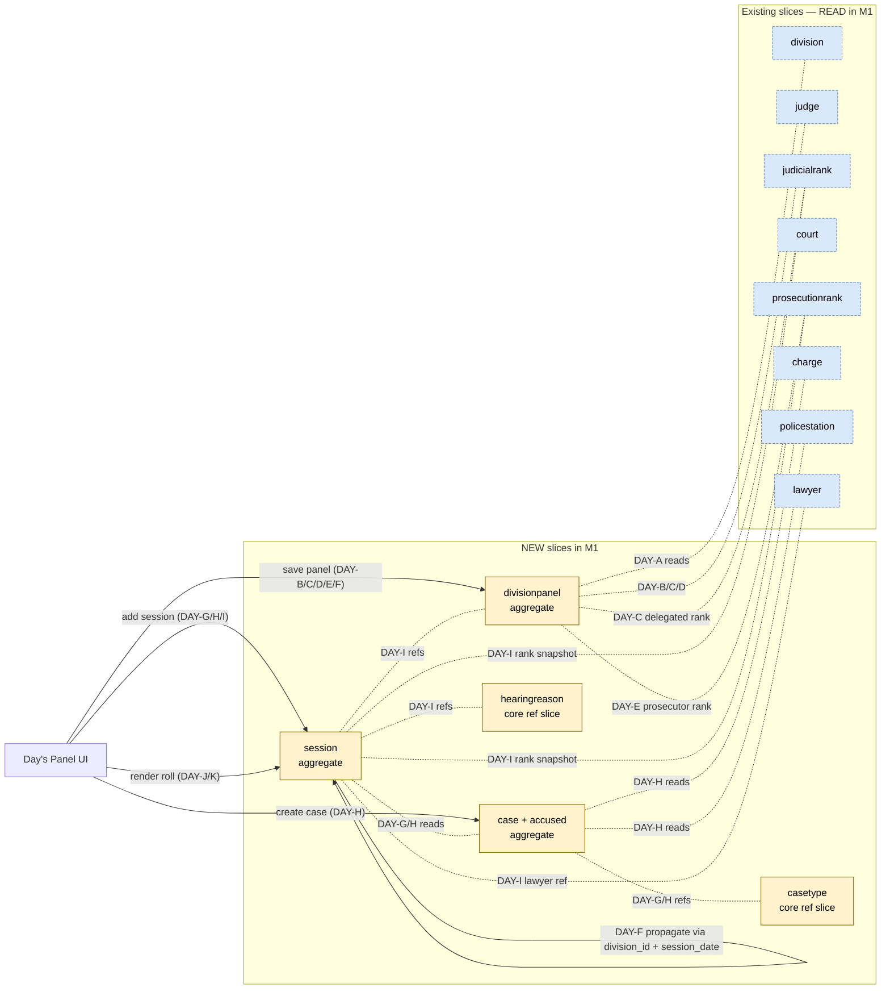
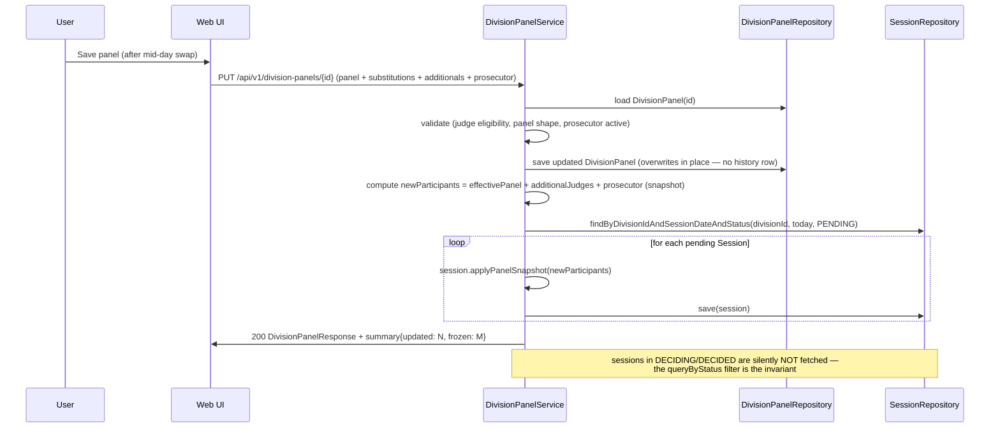

# Technical Design: M1 — Cycle 1 (جدول اليوم تجديد) — Day's Panel + Roll

**Status**: Draft (decisions marked **DECISION REQUIRED** must be settled before "Approved")
**Author**: Hisham (Tech Lead)
**Date**: 2026-06-15
**PRD**: [Initiative — Detention Renewal](../initiatives/detention-renewal.md) · Milestone 1 ticket [#28](https://github.com/apessolutions/moj_judiciary/issues/28)
**Source stories**: 11 stories (US-RNW-DAY-A through K) — [Confluence](https://apessolutions.atlassian.net/wiki/spaces/MOJ/pages/1165754369)

---

## Overview

### Summary

Build the **day's panel + day's roll** capability for detention-renewal hearings: a user composes a panel for a (division, date), optionally with delegated-judge substitutions and additional judges, sets a prosecutor, and adds sessions (each tied to a renewal case) to the day's roll. Sessions snapshot the panel at commit time. When the user saves a panel update mid-day, the change propagates to all sessions still in قيد العرض only — sessions already started or decided are frozen.

### Goals

- Author a per-(division, date) day's panel composition rooted in `Division.formation` defaults with override semantics
- Support delegated-judge substitution (قاض منتدب) as a day-scoped, never-persisted override
- Enforce the **panel-snapshot propagation invariant**: save propagates to not-yet-started sessions only
- Add sessions to the day's roll, each tied to a renewal case (existing or newly-created)
- Provide the day's roll: list / filter by status / search / drag-reorder / edit / open / soft-delete

### Non-Goals

- Cycle 2 — running a session to its قرار (out of scope; covered in M2)
- Cycle 3 — case-list management surface (out of scope; covered in M3)
- Webex/VC integration (M2 concern)
- Auto-scheduling of next renewal session (initiative-level anti-scope)

---

## Story → slice map

The 11 stories cluster into 5 new aggregate slices + reads from 7 existing slices.

| Story | New write target | Reads | Aggregate slice |
|-------|------------------|-------|-----------------|
| DAY-A — Render the day's panel | — (read only) | Division, Court, Judge, DivisionPanel | `divisionpanel` (read), `division` |
| DAY-B — Compose formation slots | DivisionPanel | Judge, Court | `divisionpanel` |
| DAY-C — Delegated-judge substitution (قاض منتدب) | DivisionPanel | Judge, JudicialRank | `divisionpanel` |
| DAY-D — Present additional judges | DivisionPanel | Judge | `divisionpanel` |
| DAY-E — Set prosecutor | DivisionPanel | Prosecution, ProsecutionRank | `divisionpanel` |
| DAY-F — Save panel & propagate | DivisionPanel + Session.* | Session | `divisionpanel`, `session` |
| DAY-G — Add session: find existing case | — (read) | Case, CaseType | `case` (read) |
| DAY-H — Add session: create case/accused/charges | Case + Accused | Charge, PoliceStation, CaseType | `case` |
| DAY-I — Commit session to roll | Session | DivisionPanel, Case, HearingReason | `session` |
| DAY-J — Day's roll list / filter / search / reorder | — (read + reorder) | Session | `session` |
| DAY-K — Day's roll edit / open / soft-delete (cascade) | Session, Case | HearingReason | `session`, `case` |

**Two additional core reference slices** are introduced as siblings to `charge` / `policestation`:

- **`core/hearingreason`** — `HearingReason` aggregate (سبب النظر); admin CRUD; referenced by Session
- **`core/casetype`** — `CaseType` aggregate (نوع القضية); admin CRUD; referenced by Case

**Existing slices newly referenced** by the new aggregates:

- `judicialrank` — referenced by DivisionPanel (delegated rank) + Session (rank snapshot)
- `prosecutionrank` — referenced by DivisionPanel + Session (prosecutor rank inline)
- `lawyer` — referenced (optionally, via `lawyer_id`) by `session_accused_lawyers`

---

## Domain Model

### New aggregates (5)

#### `DivisionPanel` aggregate — the division's current working panel composition

**ONE row per division** (no per-date history). The `currentDate` column is a freshness marker — when the clerk opens the screen on a new date, the row is overwritten from `Division.formation` defaults. Yesterday's composition is preserved only via session snapshots taken yesterday.

```
DivisionPanel (AggregateRoot)
├── id: DivisionPanelId                       (NULL when synthesized from Division.formation defaults pre-first-save)
├── divisionId: DivisionId                    (UNIQUE — one row per division)
├── panelDate: LocalDate                      (the date this composition is valid for; freshness marker. Column is panel_date, not current_date — reserved keyword in SQL Server.)
├── panel: Panel                              (the main slot judges — REUSED from division.domain.Panel; map of FormationRole → JudgeId)
├── delegatedSubstitutions: Set<DelegatedSubstitution>  (day-scoped substitutes; see entity below)
├── additionalJudges: Set<JudgeId>            (reserve judges)
├── prosecutorRankId: ProsecutionRankId?      (FK to existing prosecutionrank slice; NULL until set)
├── prosecutorName: ProsecutorName?           (free text; prosecutors are NOT tracked as aggregates; NULL until set)
├── createdAt: Instant
└── (soft-deletable for admin purposes only — normal use overwrites in place)
```

**`DelegatedSubstitution`** entity (owned by DivisionPanel — one row per delegated substitute):

```
DelegatedSubstitution (Entity)
├── formationRole: FormationRole              (PRESIDENT | RIGHT | LEFT — the slot this substitute fills)
├── name: String                              (the substitute judge's name; clerk-entered)
└── judicialRankId: JudicialRankId            (FK to existing judicialrank slice)
```

Note: delegated substitutes have no `judge_id` — they're not active judges of this court. Name + rank are entered directly.

**Storage flattens these three fields** to a single `division_panel_judges` side table (Decision #12 unchanged at storage level). The persistence mapper translates `(panel, delegatedSubstitutions, additionalJudges)` → rows with `(role, is_delegated)` and back. Domain code reads/writes the structured fields directly; storage shape is encapsulated in the adapter.

**Behaviour methods**: `register(...)`, `rehydrate(...)`, `reassignFormation(...)`, `substituteDelegated(...)`, `addAdditionalJudge(...)`, `removeAdditionalJudge(...)`, `setProsecutor(rankId, name)`, `effectivePanel() → Panel` (resolves delegations: delegated row overrides the non-delegated row for the same role), `freshenForDate(LocalDate, Panel defaults) → void` (overwrites collection from defaults when the clerk opens on a new date).

**Invariants** (compact-constructor + behaviour-method enforced):
- Panel shape (`{PRESIDENT}` vs `{PRESIDENT, RIGHT, LEFT}`) matches `Division.type` / `Court.type` rule (delegated to application service — same place Division's panel rule lives)
- At most one row per (`role`, `isDelegated`) for `role ∈ {PRESIDENT, RIGHT, LEFT}` — i.e. one assigned + at most one delegated substitute per panel slot
- Delegated substitution: a delegated row exists only if a non-delegated row exists for the same panel role (you can't substitute a slot that isn't assigned)
- Substituted judge must be active and a judge of this court
- Additional judges (`role=ADDITIONAL`) must not overlap the effective panel
- Prosecutor rank must be active

#### `Session` aggregate — a single hearing on the day's roll

References the **`Division`** directly (not DivisionPanel — the division is the legal identity that matters; DivisionPanel is just transient working state). Holds a frozen snapshot of the judge panel + prosecutor at commit time.

```
Session (AggregateRoot)
├── id: SessionId
├── divisionId: DivisionId
├── sessionDate: LocalDate            (the day this session sits on)
├── caseId: CaseId
├── hearingReasonId: HearingReasonId   (سبب النظر — refs HearingReason aggregate)
├── status: SessionStatus              (PENDING | DECIDING | DECIDED)
├── rollPosition: int                  (sparse-spaced; per-(division, sessionDate) ordering)
├── judges: Set<SessionJudge>          (judges snapshot — see below)
├── prosecutorRankId: ProsecutionRankId (snapshot — FK to prosecutionrank)
├── prosecutorName: ProsecutorName     (snapshot — free text, frozen at commit)
├── createdAt: Instant
└── (soft-deletable; cascade to Case if zero other live sessions reference caseId)
```

**`SessionJudge`** entity (owned by Session — one row per panel role + per additional judge, frozen at commit):

```
SessionJudge (Entity owned by Session)
├── judgeId: JudgeId?              (NULL when isDelegated=true — delegated judges have no judge id)
├── role: FormationRole            (PRESIDENT | RIGHT | LEFT | ADDITIONAL)
├── isDelegated: boolean           (true if this judge was a delegated substitute at commit time)
├── name: String                   (frozen at commit — copied from judge.name OR delegatedName; always present)
└── judicialRankId: JudicialRankId (frozen at commit — copied from judge.rank OR delegatedJudicialRankId; always present)
```

**Snapshot semantics**: both `name` and `judicialRankId` are ALWAYS stored on every row, even when `judgeId IS NOT NULL`. For non-delegated rows, these are copied from the `judges` aggregate at commit time so the snapshot is reproducible if the judge is renamed/re-ranked later.

**Note on prosecutor**: prosecutors are stored inline on `Session` as `(prosecutorRankId, prosecutorName)` — they aren't tracked as aggregates and don't have ids, so they don't belong in the `judges` collection.

#### `SessionAccused` entity (owned by Session — accused snapshot, one row per case-accused)

When a session is committed, the case's accused list is snapshotted. Lawyers are attached per session-accused.

```
SessionAccused (Entity owned by Session)
├── id: SessionAccusedId
├── accusedId: AccusedId           (refs case_accused.id — pointer back to the source)
├── name: String                   (frozen at commit — accused's name)
└── lawyers: List<SessionAccusedLawyer>
```

#### `SessionAccusedLawyer` entity (owned by SessionAccused — one or more lawyers per accused per session)

```
SessionAccusedLawyer (Entity owned by SessionAccused)
├── lawyerId: LawyerId?            (NULL when lawyer is added by name — same pattern as delegated judge)
└── name: String                   (always present — copied from lawyer.name OR clerk-entered ad-hoc name)
```

**Invariant**: at least `name` is set; `lawyerId` is optional. A session-accused MAY have zero lawyers (no defense assigned at session time).

**Status model**:
```
PENDING (قيد العرض) ──► DECIDING (قيد النطق بالقرار) ──► DECIDED (تم النطق بالقرار)
       ↑
   Cycle 1 creates here. Cycle 2 drives the transitions.
```

**The propagation invariant** lives on `Session`:
```java
void applyPanelSnapshot(Set<SessionJudge> newJudges, ProsecutionRankId newRankId, ProsecutorName newName) {
    if (this.status != SessionStatus.PENDING) {
        throw new InvalidSnapshotUpdateException(
            "session " + id + " is " + status + " — snapshot is frozen");
    }
    this.judges = Set.copyOf(newJudges);
    this.prosecutorRankId = newRankId;
    this.prosecutorName = newName;
}
```

The application service iterates not-yet-started sessions (queried by `division_id + session_date = today + status = PENDING`) and calls this method.

#### `Case` aggregate — renewal case

Identified by رقم + سنة + قسم شرطة + caseType. Identity fields locked at creation; aggregate contains the accused list.

```
Case (AggregateRoot)
├── id: CaseId
├── number: CaseNumber              (رقم القضية)
├── year: int                       (سنة)
├── policeStationId: PoliceStationId (قسم الشرطة)
├── caseTypeId: CaseTypeId          (نوع القضية — refs CaseType aggregate)
├── accused: List<Accused>          (entities owned by the case)
├── createdAt: Instant
└── (soft-deletable; cascade target from session delete)
```

#### `Accused` entity (owned by Case)

```
Accused (Entity owned by Case)
├── id: AccusedId
├── name: AccusedName
├── chargeIds: Set<ChargeId>        (refs Charge aggregate)
└── (no soft-delete — lifecycle bound to parent Case)
```

#### `HearingReason` aggregate (new core reference slice — `core/hearingreason`)

Reference data for سبب النظر. Admin CRUD. Values are Arabic; column is just `name`.

```
HearingReason (AggregateRoot)
├── id: HearingReasonId
├── name: HearingReasonName          (e.g. "تجديد حبس", "استئناف متهم" — Arabic content)
├── status: boolean                   (enable/disable)
├── createdAt, updatedAt
└── (soft-deletable)
```

#### `CaseType` aggregate (new core reference slice — `core/casetype`)

Reference data for نوع القضية. Admin CRUD. Values are Arabic; column is just `name`.

```
CaseType (AggregateRoot)
├── id: CaseTypeId
├── name: CaseTypeName              (e.g. "جنحة", "جناية", "اقتصادية" — Arabic content)
├── status: boolean
├── createdAt, updatedAt
└── (soft-deletable)
```

### Reused value objects from existing slices

- `Panel`, `FormationRole` — from `division.domain` (do **not** duplicate; DivisionPanel reuses `FormationRole` as the role enum for both panel + delegations + additionals)
- `JudgeId`, `CourtId`, `DivisionId`, `ProsecutionRankId`, `ChargeId`, `PoliceStationId` — existing identifier VOs
- `ProsecutorName` — new VO under `session.domain` (and reused by `divisionpanel.domain` for the prosecutor name pair)

### Domain events

| Event | Trigger | Data |
|-------|---------|------|
| `DivisionPanelSaved` | Save in DAY-F (after propagation completes) | divisionPanelId, divisionId, currentDate, updatedSessionIds, frozenSessionIds |
| `SessionCommittedToRoll` | Add to roll in DAY-I | sessionId, divisionId, sessionDate, caseId, rollPosition |
| `SessionSoftDeleted` | Soft-delete in DAY-K (incl. cascade) | sessionId, cascadedCaseId? |

(Events are advisory; M1 doesn't ship subscribers, but the seams are useful for M2 audit-log integration.)

---

## Decisions log

All load-bearing calls are now locked. Each becomes a separate AgDR under `projects/Moj/docs/agdr/` (filing pending).

| # | Decision | Locked at | Notes |
|---|----------|-----------|-------|
| 1 | **Snapshot semantics**: copy-on-commit value (frozen `name` per role) | Cap stored in `session_participants` rows; no rank captured per current call | Reproducible legal record; storage cost trivial |
| 2 | **DivisionPanel aggregate, one row per division** (not per (division, date)) — date column is a freshness marker; row overwritten when clerk opens on a new date | Renamed from "DailyPanel"; `UNIQUE(division_id)` | History lives in session snapshots only; yesterday's composition is gone |
| 3 | **Delegated-judge substitutions persisted on DivisionPanel** (never on Division.formation) | Side table `division_panel_delegated_subs` | Honors spec intent "never modifies the formation"; reload-safe |
| 4 | **Roll ordering**: integer `rollPosition` with sparse spacing (100s), scoped to (`division_id`, `session_date`) | `ix_sessions_division_date_position` | Periodic re-numbering job when gaps shrink |
| 5 | **Hearing reason (سبب النظر) as its own `core/hearingreason` slice**; FK from `sessions.hearing_reason_id`; Arabic labels; admin CRUD | New aggregate + CRUD endpoints | Replaces inline enum/value-list. Value-list pinning is now done via admin UI, no longer an SME pre-Ready blocker on DAY-I |
| 6 | **Case identity locked set** = `(number, year, police_station_id, case_type_id)` | `uq_cases_identity` | Confirm scope of edits at M3 |
| 7 | **Soft-delete cascade** = count-based; no extra column on `sessions` | DAY-K DELETE handler counts live sessions on `case_id`; cascades when zero | Transactional with row lock on case |
| 8 | **Judge snapshot storage** = single `session_judges` side table for panel roles + additionals, with `role` + `is_delegated` columns | Mirrors `division_panel_judges`; prosecutor handled separately (see #11) | Future panel shapes extend by adding role enum values |
| 9 | **Case type as its own `core/casetype` slice**; FK from `cases.case_type_id`; Arabic content; admin CRUD | New aggregate + CRUD endpoints | Same pattern as `charge` / `policestation` / `hearingreason` |
| 10 | **Session references `Division` directly**, not `DivisionPanel` | Columns `division_id` + `session_date` on `sessions`; no `division_panel_id` FK on Session | DivisionPanel is transient working state; sessions stand alone |
| 11 | **Prosecutor is NOT an aggregate** — stored as `(prosecutor_rank_id, prosecutor_name)` pair inline on both `division_panels` and `sessions` | FK to existing `prosecutionrank` slice; name is free text | Prosecutors aren't tracked individually in moj_judiciary |
| 12 | **DivisionPanel + Session judges each live in ONE side table** with `role` + `is_delegated` (PRESIDENT/RIGHT/LEFT/ADDITIONAL × delegated bool) — no separate panel-slot / delegation / additionals tables | `division_panel_judges` + `session_judges` schemas | Domain reads it as panel/delegations/additionals via filtering; storage is one collection |
| 13 | **Reference-data column = `name`** (not `name_ar`) on `hearing_reasons` and `case_types` | Values are Arabic content; column name is locale-neutral | Matches the rest of the codebase (e.g. `charges.name`, `police_stations.name`) |
| 14 | **Delegated judges have no `judge_id`** — `judge_id` is NULL; `name` + `judicial_rank_id` are clerk-entered. Same pattern on Session snapshot. | XOR CHECK constraint on `division_panel_judges`; `session_judges.judge_id` nullable | Substitute judges are external — they're not active judges of this court, so no `judges` row exists |
| 15 | **Session-accused with lawyers snapshot** — new `session_accused` table mirrors `case_accused` at commit time; `session_accused_lawyers` allows registered lawyer (FK to `lawyers`) OR ad-hoc name. Same delegated/registered pattern as judges. | New side tables under `session` slice | Per-session legal record includes who was defending whom |
| 16 | **Judge snapshot DOES capture rank** (`judicial_rank_id` always on `session_judges`) — previous deferral resolved | Was an Open Question; resolved by your "name and rankId" call | Court records show rank alongside name |

**AgDRs to file** (one per decision; canonical ID sequence on first save):

| Slug | Decision |
|------|----------|
| `AgDR-0001-snapshot-copy-on-commit-semantics` | #1 |
| `AgDR-0002-division-panel-one-row-per-division` | #2 |
| `AgDR-0003-delegated-judge-persistence` | #3 |
| `AgDR-0004-roll-ordering-integer-position` | #4 |
| `AgDR-0005-hearingreason-core-slice` | #5 |
| `AgDR-0006-case-identity-locked-set` | #6 |
| `AgDR-0007-soft-delete-cascade-count-based` | #7 |
| `AgDR-0008-session-judges-snapshot-table` | #8 |
| `AgDR-0009-casetype-core-slice` | #9 |
| `AgDR-0010-session-references-division-directly` | #10 |
| `AgDR-0011-prosecutor-as-rank-plus-name` | #11 |
| `AgDR-0012-judges-single-side-table-pattern` | #12 |
| `AgDR-0013-reference-data-name-column-convention` | #13 |
| `AgDR-0014-delegated-judge-without-judge-id` | #14 |
| `AgDR-0015-session-accused-with-lawyers-snapshot` | #15 |
| `AgDR-0016-judge-snapshot-captures-rank` | #16 |

---

## Architecture

### Component Diagram



### Data flow — DAY-F (the load-bearing invariant)



The application service explicitly queries `status = PENDING` AND `session_date = today` for propagation — sessions in DECIDING/DECIDED, or on a different day, are never touched. Session's `applyPanelSnapshot()` throws if status ≠ PENDING as a belt-and-braces backstop.

---

## API Design

### Endpoint summary

| # | Method | Path | Story | Slice |
|---|--------|------|-------|-------|
| 1 | GET | `/api/v1/division-panels?divisionId={id}&date=YYYY-MM-DD` | DAY-A | divisionpanel |
| 2a | POST | `/api/v1/division-panels` (first save) | DAY-B/C/D/E/F | divisionpanel |
| 2b | PUT | `/api/v1/division-panels/{id}` (update) | DAY-B/C/D/E/F | divisionpanel |
| 3 | POST | `/api/v1/cases/search` | DAY-G | case |
| 4 | POST | `/api/v1/cases` | DAY-H | case |
| 5 | POST | `/api/v1/divisions/{id}/sessions` | DAY-I | session |
| 6 | GET | `/api/v1/divisions/{id}/sessions?date=&status=&q=` | DAY-J | session |
| 7 | PUT | `/api/v1/sessions/{sid}/position` | DAY-J | session |
| 8 | PUT | `/api/v1/sessions/{id}` | DAY-K | session |
| 9 | DELETE | `/api/v1/sessions/{id}` | DAY-K | session |
| **Admin reference data — siblings to existing `/api/v1/charges` etc.** | | | | |
| 10 | GET / POST / PUT / DELETE | `/api/v1/hearing-reasons[/{id}]` | (admin) | hearingreason |
| 11 | GET / POST / PUT / DELETE | `/api/v1/case-types[/{id}]` | (admin) | casetype |

All endpoints require authentication (JWT, inherited from `iam/auth`). Each is `@PreAuthorize`-guarded by the appropriate `XPermission.Authority.*` constant.

All endpoints follow `backend/CLAUDE.md` § "DTOs, validation, and 422 errors": Bean Validation on request DTOs, dotted `errors` map on 422, slice-local exception handler for not-found / state-conflict mapped via `@RestControllerAdvice(assignableTypes = XController.class)`.

---

### 1 — `GET /api/v1/divisions/{id}/panel?date=YYYY-MM-DD` (DAY-A)

**Purpose**: resolve the current DivisionPanel for this division. If the persisted row's `currentDate` is stale (≠ requested date), overwrite from `Division.formation` defaults before returning. If no row exists yet, return defaults inline (no DB write). If `currentDate = requested date`, return as-is.

**Query params**:
- `date` (`YYYY-MM-DD`, required) — the day the clerk is preparing for

**Response** `200 OK`:
```json
{
  "divisionPanelId": "uuid-or-null-if-not-yet-saved",
  "divisionId": "uuid",
  "currentDate": "2026-06-15",
  "requiredPanelShape": "SINGLE" | "PANEL_3",
  "panel": {
    "presidentJudge":  { "id": "uuid", "name": "..." } | null,
    "rightJudge":      { "id": "uuid", "name": "..." } | null,
    "leftJudge":       { "id": "uuid", "name": "..." } | null
  },
  "delegatedSubstitutions": [
    {
      "formationRole": "PRESIDENT" | "RIGHT" | "LEFT",
      "name": "...",
      "judicialRank": { "id": "uuid", "name": "..." }
    }
  ],
  "additionalJudges": [ { "id": "uuid", "name": "..." } ],
  "prosecutor": {
    "rank": { "id": "uuid", "name": "..." },
    "name": "..."
  } | null,
  "isPersisted": false | true,
  "sourceOfDefaults": "DIVISION_FORMATION" | "PERSISTED_ROW"
}
```

**Errors**:
- `404` `DIVISION_NOT_FOUND` — division id unknown
- `403` `DIVISION_OUT_OF_SCOPE` — user lacks visibility on this division (per user-scoping enabler)

---

### 2 — `PUT /api/v1/division-panels/{id}` (DAY-B/C/D/E/F — the load-bearing save)

**Purpose**: persist the division's working panel composition AND propagate to PENDING sessions on (divisionId, today). Idempotent. Overwrites in place — no history row.

**Resource lifecycle**: endpoint 1 always returns a `divisionPanelId` (real if persisted, null if not). On first save, the client passes a tombstone body shape (`id` null in URL is not idiomatic for PUT — instead, **use `POST /api/v1/divisions/{id}/panel` for first-time create**, then `PUT /api/v1/division-panels/{id}` for subsequent updates). The application service treats `POST` as upsert (since `UNIQUE(division_id)` guarantees at most one row exists).

**Request**:
```json
{
  "currentDate": "2026-06-15",
  "panel": {
    "singleJudgeId":    "uuid" | null,
    "presidentJudgeId": "uuid" | null,
    "rightJudgeId":     "uuid" | null,
    "leftJudgeId":      "uuid" | null
  },
  "delegatedSubstitutions": [
    {
      "formationRole": "PRESIDENT" | "RIGHT" | "LEFT",
      "delegatedName": "...",
      "delegatedJudicialRankId": "uuid"
    }
  ],
  "additionalJudgeIds": [ "uuid", "..." ],
  "prosecutorRankId": "uuid",
  "prosecutorName": "..."
}
```

**Validation** (Bean Validation + service-layer):
- `currentDate`, `prosecutorRankId`, `prosecutorName` required (`@NotNull` / `@NotBlank`)
- Exactly one of `singleJudgeId` OR (`presidentJudgeId` + `rightJudgeId` + `leftJudgeId`) per `requiredPanelShape` (enforced in service via `FieldValidationException` — same pattern as `DivisionApplicationService` validates panel shape today)
- Panel judges must be distinct
- `delegatedSubstitutions[].formationRole` must exist in the active panel composition
- `delegatedSubstitutions[].delegatedName` non-blank; `delegatedJudicialRankId` exists in `judicialrank` slice
- All judge ids in `panel` + `additionalJudgeIds` active + judges-of-this-court
- `prosecutorRankId` exists + active in `prosecutionrank` slice
- Additional judges must NOT overlap (panel ∪ delegated-substitution targets)

**Response** `200 OK`:
```json
{
  "divisionPanel": { /* same shape as endpoint 1's response */ },
  "propagationSummary": {
    "sessionsUpdated": 3,
    "sessionsFrozen": 1,
    "updatedSessionIds": ["uuid", "..."],
    "frozenSessionIds":  ["uuid"]
  }
}
```

**Errors**:
- `422` field errors (dotted paths like `panel.rightJudgeId`, `additionalJudgeIds.2`, `prosecutorId`)
- `404` `DIVISION_NOT_FOUND` / `JUDGE_NOT_FOUND` / `PROSECUTION_NOT_FOUND`
- `409` `DIVISION_PANEL_DATE_PAST` — saving for a date < today (decision: reject, confirm with SME)

---

### 3 — `POST /api/v1/cases/search` (DAY-G — global case lookup)

**Purpose**: find an existing renewal case by the 4-field identity tuple.

**Request**:
```json
{
  "number": "...",
  "year": 2026,
  "policeStationId": "uuid",
  "caseType": "..."
}
```

**Response** `200 OK`:
```json
{
  "case": {
    "id": "uuid",
    "number": "...",
    "year": 2026,
    "policeStation": { "id": "uuid", "name": "..." },
    "caseType": "...",
    "accused": [
      {
        "id": "uuid",
        "name": "...",
        "charges": [ { "id": "uuid", "name": "..." } ]
      }
    ]
  } | null,
  "found": true | false
}
```

**Errors**:
- `422` if any of the 4 fields missing/invalid

---

### 4 — `POST /api/v1/cases` (DAY-H — create case)

**Purpose**: create a new renewal case with accused + charges. Used when search (#3) returns `found: false`.

**Request**:
```json
{
  "number": "...",
  "year": 2026,
  "policeStationId": "uuid",
  "caseTypeId": "uuid",
  "accused": [
    {
      "name": "...",
      "chargeIds": [ "uuid", "..." ]
    }
  ]
}
```

**Validation**:
- All 4 identity fields required (DECISION 6 locked set; `caseTypeId` references new `casetype` slice)
- `accused` non-empty; each `accused[i].name` non-blank; each `chargeIds` non-empty
- Uniqueness on `(number, year, policeStationId, caseTypeId)` — DB unique constraint surfaces as `422` field error
- `chargeIds` validated to exist + active
- `caseTypeId` validated to exist + active

**Response** `201 Created`:
```json
{ /* same shape as the case payload in endpoint 3's response */ }
```

**Errors**:
- `422` `CASE_IDENTITY_TAKEN` — uniqueness violation, mapped to `errors.number` field path
- `422` `CHARGE_NOT_FOUND` / `POLICE_STATION_NOT_FOUND` / `CASE_TYPE_NOT_FOUND` — at the offending field path
- `422` other Bean-Validation failures

---

### 5 — `POST /api/v1/divisions/{id}/sessions` (DAY-I — commit session to roll)

**Purpose**: append a new session to the roll for (this division, today), snapshot the current panel + prosecutor at this moment.

**Request**:
```json
{
  "sessionDate": "2026-06-15",
  "caseId": "uuid",
  "hearingReasonId": "uuid",
  "accusedLawyers": [
    {
      "accusedId": "uuid",
      "lawyers": [
        { "lawyerId": "uuid" },
        { "name": "..." }
      ]
    }
  ]
}
```

**Validation**:
- `sessionDate` required; must be ≥ today (or matches DivisionPanel.currentDate — confirm with SME)
- `caseId` required; case must exist + not deleted
- `hearingReasonId` required; must exist + active in `hearingreason` slice
- DivisionPanel for this division must be in a "complete" state (panel + prosecutor set) — surfaces as `422` `DIVISION_PANEL_INCOMPLETE`
- `accusedLawyers` (optional) — each `accusedId` must exist in `case.accused`. Each `lawyers[i]` MUST have either `lawyerId` OR `name` (not both, not neither). `lawyerId` validated against `lawyers` slice.

**Behaviour**:
- Snapshot frozen from current DivisionPanel state — resolve `effectivePanel = panel ⊕ delegatedSubstitutions`, materialize `SessionJudge` rows (each with `name` + `judicial_rank_id` copied from `judges` or from the delegated entry) + inline prosecutor snapshot (rank_id + name copied from DivisionPanel)
- Snapshot all case-accused as `SessionAccused` rows (name copied from `case_accused.name`)
- Attach lawyers per session-accused per the request body (zero or more); when `lawyerId` present, copy name from `lawyers`; when ad-hoc, use `name` as-is
- `rollPosition` = `MAX(roll_position) WHERE division_id=X AND session_date=Y` + 100 — sparse spacing per Decision 4
- Status set to `PENDING`

**Response** `201 Created`:
```json
{
  "id": "uuid",
  "divisionId": "uuid",
  "sessionDate": "2026-06-15",
  "case": { /* case payload (full, not snapshot) */ },
  "hearingReason": { "id": "uuid", "name": "..." },
  "status": "PENDING",
  "rollPosition": 100,
  "judges": [
    { "judgeId": "uuid", "role": "PRESIDENT",  "isDelegated": false, "name": "...", "judicialRank": { "id": "uuid", "name": "..." } },
    { "judgeId": "uuid", "role": "RIGHT",      "isDelegated": false, "name": "...", "judicialRank": { "id": "uuid", "name": "..." } },
    { "judgeId": null,   "role": "LEFT",       "isDelegated": true,  "name": "...", "judicialRank": { "id": "uuid", "name": "..." } },
    { "judgeId": "uuid", "role": "ADDITIONAL", "isDelegated": false, "name": "...", "judicialRank": { "id": "uuid", "name": "..." } }
  ],
  "prosecutor": {
    "rank": { "id": "uuid", "name": "..." },
    "name": "..."
  },
  "accused": [
    {
      "id": "uuid",
      "accusedId": "uuid",
      "name": "...",
      "lawyers": [
        { "lawyerId": "uuid", "name": "..." },
        { "lawyerId": null,   "name": "..." }
      ]
    }
  ],
  "createdAt": "2026-06-15T08:30:00Z"
}
```

**Errors**:
- `422` `DIVISION_PANEL_INCOMPLETE` — panel or prosecutor not set on division
- `422` `CASE_NOT_FOUND` / `CASE_SOFT_DELETED`
- `422` `HEARING_REASON_NOT_FOUND` / `HEARING_REASON_INACTIVE`
- `422` `LAWYER_NOT_FOUND` / `ACCUSED_NOT_ON_CASE` at the offending field path

---

### 6 — `GET /api/v1/divisions/{id}/sessions?date=&status=&q=&page=&limit=` (DAY-J — list/filter/search the roll)

**Purpose**: render the day's roll for (division, date), optionally filtered by status / searched by free-text case fields.

**Query params**:
- `date` (required, `YYYY-MM-DD`) — the day's roll to render
- `status` (optional) — `PENDING` / `DECIDING` / `DECIDED`
- `q` (optional) — free-text search; matches case `number`, accused `name`
- `page`, `limit` — standard pagination (1-based, default 20, max 100 per `application.properties`)
- Default sort: `rollPosition ASC` (server-controlled)

**Response** `200 OK`:
```json
{
  "data": [ { /* session payload like endpoint 5's response */ } ],
  "page": 1,
  "limit": 20,
  "total": 17
}
```

---

### 7 — `PUT /api/v1/sessions/{sid}/position` (DAY-J — drag-reorder)

**Purpose**: change a session's `rollPosition`. Two shapes supported.

**Request shape A** — explicit position (preferred):
```json
{ "rollPosition": 250 }
```

**Request shape B** — relative ("after"):
```json
{ "afterSessionId": "uuid" }
```
Server resolves to `rollPosition = (afterSession.rollPosition + nextSession.rollPosition) / 2`, falling back to `+100` if at the end. Triggers a re-numbering job if the resolved gap < threshold (e.g. 2).

**Response** `200 OK`: same shape as endpoint 5.

**Errors**:
- `422` `SESSION_NOT_FOUND`

---

### 8 — `PUT /api/v1/sessions/{id}` (DAY-K — edit session)

**Purpose**: edit non-snapshot fields on a PENDING session.

**Request**:
```json
{
  "hearingReasonId": "uuid"
}
```

Notes:
- `caseId` is NOT editable here (replace the session if the case is wrong)
- Snapshot fields (participants) are FROZEN — not editable from this endpoint
- `sessionDate` is NOT editable — replace the session if it's on the wrong day

**Validation**:
- Session status must be `PENDING` — otherwise `409` `SESSION_NOT_PENDING` (edit-on-decided is a different workflow)

**Response** `200 OK`: same shape as endpoint 5.

---

### 9 — `DELETE /api/v1/sessions/{id}` (DAY-K — soft-delete with optional cascade)

**Purpose**: soft-delete a session. If no other live sessions reference its case, soft-delete the case too (DECISION 7).

**Request**: no body.

**Behaviour** (single transaction with row lock on the case):
1. Load session; refuse if not PENDING (`409` `SESSION_NOT_PENDING_DELETE`)
2. Set `session.deleted_at = now`
3. Count other live sessions on `session.case_id`
4. If count = 0 → set `case.deleted_at = now`
5. Emit `SessionSoftDeleted` event

**Response** `200 OK`:
```json
{ "cascadedCaseId": "uuid" | null }
```

**Errors**:
- `404` `SESSION_NOT_FOUND`
- `409` `SESSION_NOT_PENDING_DELETE` — already DECIDING/DECIDED

---

### Cross-cutting error response shape

Per `backend/CLAUDE.md` § "DTOs, validation, and 422 errors" — global handler emits:

```json
{
  "status": 422,
  "title": "Validation failed",
  "errors": {
    "panel.rightJudgeId": "judge is not eligible for this court",
    "additionalJudgeIds.2": "judge already in formation",
    "prosecutorId": "prosecution office inactive"
  }
}
```

For domain errors (not-found, conflict), per-slice `XExceptionHandler` emits a localized title + detail via `MessageKeys.Errors.*` constants. **Never raw English strings** in messages.

---

## Data Model

New tables across 5 new slices (`divisionpanel`, `case`, `session`, `hearingreason`, `casetype`). All conform to `backend/CLAUDE.md` § "Persistence / SQL conventions": UUID PKs app-assigned (`uniqueidentifier`), table names plural, column names singular, enums as `NVARCHAR`, audit columns on every aggregate, soft delete via `SoftDeletableJpaEntity`, per-module Flyway folder under `classpath:db/migration/<module>/V<prefix>_NNN__name.sql`.

**Flyway prefix allocation** (`shared/` = `V0_*`, `iam/` = `V1_*`, existing core slices occupy `V2_*`):

| Module | Flyway prefix |
|--------|---------------|
| `divisionpanel` | `V3_*` |
| `hearingreason` | `V5_*` |
| `casetype` | `V6_*` |
| `case` | `V7_*` |
| `session` | `V8_*` |

Note: `divisionpanel` landed first (DAY-A) so it claimed `V3_*`. Reference-data slices (`hearingreason`, `casetype`) sequence before `case` and `session` because the latter reference them via FK. `V4_*` left as a buffer for future divisionpanel migrations.

### `hearingreason` slice — sibling of `charge` / `policestation`

#### `hearing_reasons` — HearingReason aggregate root (سبب النظر)

| Column | Type | Null | Notes |
|--------|------|------|-------|
| `id` | `uniqueidentifier` | NOT NULL | PK (`pk_hearing_reasons`) |
| `name` | `nvarchar(255)` | NOT NULL | Label (Arabic content, e.g. "تجديد حبس", "استئناف متهم"). Unique-when-active. |
| `status` | `bit` | NOT NULL | Enable/disable flag |
| `created_at` | `datetime2` | NOT NULL | |
| `updated_at` | `datetime2` | NOT NULL | |
| `deleted_at` | `datetime2` | NULL | Soft delete |

**Constraints / indexes**: `uq_hearing_reasons_name` UNIQUE (`name`) WHERE `deleted_at IS NULL`.

### `casetype` slice — sibling of `charge` / `policestation`

#### `case_types` — CaseType aggregate root (نوع القضية)

| Column | Type | Null | Notes |
|--------|------|------|-------|
| `id` | `uniqueidentifier` | NOT NULL | PK (`pk_case_types`) |
| `name` | `nvarchar(255)` | NOT NULL | Label (Arabic content, e.g. "جنحة", "جناية", "اقتصادية"). Unique-when-active. |
| `status` | `bit` | NOT NULL | Enable/disable flag |
| `created_at` | `datetime2` | NOT NULL | |
| `updated_at` | `datetime2` | NOT NULL | |
| `deleted_at` | `datetime2` | NULL | Soft delete |

**Constraints / indexes**: `uq_case_types_name` UNIQUE (`name`) WHERE `deleted_at IS NULL`.

### `divisionpanel` slice

#### `division_panels` — DivisionPanel aggregate root (**one row per division**)

| Column | Type | Null | Notes |
|--------|------|------|-------|
| `id` | `uniqueidentifier` | NOT NULL | PK (`pk_division_panels`), app-assigned |
| `division_id` | `uniqueidentifier` | NOT NULL | FK `fk_division_panels_division_id` → `divisions(id)`. **UNIQUE.** |
| `panel_date` | `date` | NOT NULL | Freshness marker — the date this composition is valid for; overwritten when clerk opens on a new date. (Named `panel_date` not `current_date` because the latter is a SQL Server reserved keyword.) |
| `prosecutor_rank_id` | `uniqueidentifier` | NULL | FK `fk_division_panels_prosecutor_rank_id` → `prosecution_ranks(id)`. NULL until set (DAY-E). |
| `prosecutor_name` | `nvarchar(255)` | NULL | Free-text prosecutor name. NULL until set. Prosecutors aren't tracked as aggregates. |
| `created_at` | `datetime2` | NOT NULL | |
| `updated_at` | `datetime2` | NOT NULL | Hibernate `@UpdateTimestamp` |
| `deleted_at` | `datetime2` | NULL | Soft delete (admin only — normal use overwrites in place) |

**Constraints / indexes**:
- `uq_division_panels_division_id` UNIQUE (`division_id`) WHERE `deleted_at IS NULL` — **one row per division, no historical accumulation**
- `@SQLRestriction("deleted_at IS NULL")` on the JPA entity

#### `division_panel_judges` — **single side table** for panel + delegations + additionals (the `judges` collection on DivisionPanel)

| Column | Type | Null | Notes |
|--------|------|------|-------|
| `id` | `uniqueidentifier` | NOT NULL | PK (`pk_division_panel_judges`), app-assigned |
| `division_panel_id` | `uniqueidentifier` | NOT NULL | FK CASCADE → `division_panels(id)` |
| `judge_id` | `uniqueidentifier` | NULL | FK → `judges(id)`. **NULL when `is_delegated = 1`** (delegated judges have no judge id) |
| `role` | `nvarchar(20)` | NOT NULL | Enum: `PRESIDENT` / `RIGHT` / `LEFT` / `ADDITIONAL` |
| `is_delegated` | `bit` | NOT NULL | `true` when this judge is a day-scoped delegated substitute filling the role |
| `delegated_name` | `nvarchar(255)` | NULL | Set when `is_delegated = 1`; the clerk-entered substitute name. NULL otherwise (name derived live from `judges` for non-delegated). |
| `delegated_judicial_rank_id` | `uniqueidentifier` | NULL | FK → `judicial_ranks(id)`. Set when `is_delegated = 1`. NULL otherwise. |

**Constraints**:
- CHECK: `judge_id IS NOT NULL` XOR (`delegated_name IS NOT NULL AND delegated_judicial_rank_id IS NOT NULL`) — exactly one shape per row
- `uq_division_panel_judges_panel_role_assigned` UNIQUE (`division_panel_id`, `role`) WHERE `role <> 'ADDITIONAL'` AND `is_delegated = 0` — at most one assigned per panel role
- `uq_division_panel_judges_panel_role_delegated` UNIQUE (`division_panel_id`, `role`) WHERE `role <> 'ADDITIONAL'` AND `is_delegated = 1` — at most one delegated per panel role

`ADDITIONAL` rows have no per-role uniqueness — multiple additional judges allowed. `@BatchSize(50)`.

### `case` slice

#### `cases` — Case aggregate root

| Column | Type | Null | Notes |
|--------|------|------|-------|
| `id` | `uniqueidentifier` | NOT NULL | PK (`pk_cases`) |
| `number` | `nvarchar(50)` | NOT NULL | رقم القضية (may be alphanumeric — verify with SME) |
| `year` | `int` | NOT NULL | سنة |
| `police_station_id` | `uniqueidentifier` | NOT NULL | FK `fk_cases_police_station_id` → `police_stations(id)` |
| `case_type_id` | `uniqueidentifier` | NOT NULL | FK `fk_cases_case_type_id` → `case_types(id)` |
| `created_at` | `datetime2` | NOT NULL | |
| `updated_at` | `datetime2` | NOT NULL | |
| `deleted_at` | `datetime2` | NULL | Soft delete (cascade target from session delete) |

**Constraints / indexes**:
- `uq_cases_identity` UNIQUE (`number`, `year`, `police_station_id`, `case_type_id`) WHERE `deleted_at IS NULL` — the locked-identity tuple from DECISION 6
- `ix_cases_search` composite (`number`, `year`) — for the global 4-field search in DAY-G
- `ix_cases_police_station_id` — secondary search dimension
- `ix_cases_case_type_id` — secondary search dimension

#### `case_accused` — Accused entities (owned by Case)

| Column | Type | Null | Notes |
|--------|------|------|-------|
| `id` | `uniqueidentifier` | NOT NULL | PK (`pk_case_accused`) |
| `case_id` | `uniqueidentifier` | NOT NULL | FK CASCADE → `cases(id)` |
| `name` | `nvarchar(255)` | NOT NULL | Accused name |
| `created_at` | `datetime2` | NOT NULL | |
| `updated_at` | `datetime2` | NOT NULL | |

No `deleted_at` — Accused lifecycle is bound to its parent Case (Case soft-delete cascades; physically remains).

**Indexes**: `ix_case_accused_case_id` for the loaded-by-case pattern.

#### `case_accused_charges` — junction (Set<ChargeId> per accused)

| Column | Type | Null | Notes |
|--------|------|------|-------|
| `accused_id` | `uniqueidentifier` | NOT NULL | FK CASCADE → `case_accused(id)` |
| `charge_id` | `uniqueidentifier` | NOT NULL | FK → `charges(id)` |

**PK**: composite (`accused_id`, `charge_id`).

### `session` slice

> **Naming addendum (2026-06-16, PR #65 build-time)**: the four tables in this slice ship under the `court_*` prefix — `court_sessions`, `court_session_judges`, `court_session_accused`, `court_session_accused_lawyers` — rather than the original `sessions` / `session_*` shape this section was drafted with. The rename is defensive against SQL Server's session-related reserved-word footguns (`SESSION_USER` etc.) and was kept after CEO review. Aggregate / JPA-entity / port names are unchanged; only the physical table identifiers carry the prefix. Indexes / constraints follow `pk_court_sessions`, `ix_court_sessions_*`, `fk_court_sessions_*`.

#### `sessions` (physical: `court_sessions`) — Session aggregate root

Inline prosecutor snapshot (prosecutor has no id — rank + name only).

| Column | Type | Null | Notes |
|--------|------|------|-------|
| `id` | `uniqueidentifier` | NOT NULL | PK (`pk_sessions`) |
| `division_id` | `uniqueidentifier` | NOT NULL | FK `fk_sessions_division_id` → `divisions(id)`. Session is identified by division + date, not by DivisionPanel. |
| `session_date` | `date` | NOT NULL | The day this session sits on (== day's roll it belongs to) |
| `case_id` | `uniqueidentifier` | NOT NULL | FK `fk_sessions_case_id` → `cases(id)` |
| `hearing_reason_id` | `uniqueidentifier` | NOT NULL | FK `fk_sessions_hearing_reason_id` → `hearing_reasons(id)` (سبب النظر) |
| `status` | `nvarchar(30)` | NOT NULL | Enum: `PENDING` / `DECIDING` / `DECIDED` |
| `roll_position` | `int` | NOT NULL | Sparse spacing (100, 200, 300…) per Decision 4; scoped to (division_id, session_date) |
| `prosecutor_rank_id` | `uniqueidentifier` | NOT NULL | FK `fk_sessions_prosecutor_rank_id` → `prosecution_ranks(id)`. **Snapshot — frozen at commit.** |
| `prosecutor_name` | `nvarchar(255)` | NOT NULL | Free-text prosecutor name. **Snapshot — frozen at commit.** |
| `created_at` | `datetime2` | NOT NULL | |
| `updated_at` | `datetime2` | NOT NULL | |
| `deleted_at` | `datetime2` | NULL | Soft delete |

**Constraints / indexes**:
- `ix_sessions_division_date_status` composite (`division_id`, `session_date`, `status`) — **load-bearing for DAY-F propagation** (single index scan to find all PENDING sessions for (division, today))
- `ix_sessions_case_id` — for the soft-delete cascade count (Decision 7)
- `ix_sessions_division_date_position` composite (`division_id`, `session_date`, `roll_position`) — day's roll ordering query
- Domain-level constraint: `applyPanelSnapshot()` throws if `status ≠ PENDING` (belt-and-braces against the propagation invariant)

#### `session_judges` — side table for the judge panel snapshot

One row per panel slot + per additional judge. **Judges only** — prosecutor lives inline on `sessions` (it has no id). `name` + `judicial_rank_id` are ALWAYS stored as a copy-on-commit snapshot.

| Column | Type | Null | Notes |
|--------|------|------|-------|
| `id` | `uniqueidentifier` | NOT NULL | PK (`pk_session_judges`), app-assigned |
| `session_id` | `uniqueidentifier` | NOT NULL | FK CASCADE → `sessions(id)` |
| `judge_id` | `uniqueidentifier` | NULL | Original judge id; **NOT a FK** (snapshot stays stable after delete/rename). **NULL for delegated rows** (delegated judges have no judge id). |
| `role` | `nvarchar(20)` | NOT NULL | Enum: `PRESIDENT` / `RIGHT` / `LEFT` / `ADDITIONAL` |
| `is_delegated` | `bit` | NOT NULL | `true` if this judge was a delegated substitute at commit time; `false` otherwise |
| `name` | `nvarchar(255)` | NOT NULL | Frozen at commit — copied from `judges.name` (non-delegated) or `delegated_name` (delegated). Always present. |
| `judicial_rank_id` | `uniqueidentifier` | NOT NULL | Frozen at commit — copied from the judge's rank (non-delegated) or the delegated rank (delegated). FK to `judicial_ranks` but no enforced FK on this snapshot column. |

**Indexes**: `ix_session_judges_session_id` for `@BatchSize(50)` loading by session.

**Cardinality per session**: exactly 1 PRESIDENT row; 0 or 2 RIGHT+LEFT rows (both present for 3-judge, both absent for single-judge); N ADDITIONAL rows (0..many). A delegated judge appears with `is_delegated=true` and `judge_id IS NULL` in the role they fill — the absent original judge isn't recorded in the snapshot (only the actual sitting panel is the legal record).

#### `session_accused` — snapshot of case-accused at session commit time

| Column | Type | Null | Notes |
|--------|------|------|-------|
| `id` | `uniqueidentifier` | NOT NULL | PK (`pk_session_accused`), app-assigned |
| `session_id` | `uniqueidentifier` | NOT NULL | FK CASCADE → `sessions(id)` |
| `accused_id` | `uniqueidentifier` | NOT NULL | Pointer to `case_accused(id)`. NOT a FK on storage — keeps snapshot stable if case-accused is later edited. |
| `name` | `nvarchar(255)` | NOT NULL | Accused name, frozen at commit |

**Indexes**: `ix_session_accused_session_id` for batch loading by session.

#### `session_accused_lawyers` — lawyers per session-accused (snapshot + ad-hoc)

| Column | Type | Null | Notes |
|--------|------|------|-------|
| `id` | `uniqueidentifier` | NOT NULL | PK (`pk_session_accused_lawyers`), app-assigned |
| `session_accused_id` | `uniqueidentifier` | NOT NULL | FK CASCADE → `session_accused(id)` |
| `lawyer_id` | `uniqueidentifier` | NULL | FK → `lawyers(id)` when the lawyer is a registered lawyer aggregate; NULL when added ad-hoc by name |
| `name` | `nvarchar(255)` | NOT NULL | Always present — copied from `lawyers.name` (registered) or clerk-entered ad-hoc name |

**Indexes**: `ix_session_accused_lawyers_session_accused_id` for batch loading.

**Cardinality**: a session-accused MAY have zero lawyers (no defense). Multiple lawyers allowed.

### Access patterns

| Access Pattern | Query / Index used |
|----------------|---------------------|
| Resolve / create DivisionPanel for (division) (DAY-A) | `uq_division_panels_division_id` lookup; join `division_panel_judges` for the composition |
| Compute effective panel for snapshot (DAY-F propagation, DAY-I commit) | Filter `division_panel_judges` by role: per panel role, `is_delegated=true` row wins over `is_delegated=false`. ADDITIONAL rows surface as-is. |
| Propagate panel update to today's PENDING sessions on division (DAY-F) | `ix_sessions_division_date_status` covered scan |
| Global 4-field case search (DAY-G) | `ix_cases_search` + `uq_cases_identity` |
| Day's roll list / status filter / search (DAY-J) | `ix_sessions_division_date_position` + `Specs.textSearch` on case fields |
| Soft-delete cascade count (DAY-K) | `ix_sessions_case_id` count on `deleted_at IS NULL` |

### Schema-level decisions worth flagging

1. **`session_judges` — one normalized snapshot table for all judge roles** (Decision 1 snapshot semantics + Decision 8 single-table). Drops the 12 inline columns from `sessions` for the panel. Follows the Division-style normalization.
2. **`judge_id` in `session_judges` is intentionally NOT a FK** — the judge could be soft-deleted or renamed later; the snapshot must remain stable. The `name` is stored alongside for the same reason.
3. **Prosecutor lives inline on `sessions`** as `prosecutor_rank_id` (FK to `prosecution_ranks`) + `prosecutor_name` (free text). Prosecutors are not tracked as aggregates — they don't have ids. Same shape on `division_panels` for the working state.
4. **`division_panel_judges` is the single side table** for panel + delegated substitutions + additional judges. The domain computes the effective panel by filtering this collection. Per-slot uniqueness enforced by filtered uniques.
5. **No `effective_panel_*` view on `division_panels`** — the effective panel is computed in domain code at snapshot time. The substitution rule lives in one place (the aggregate).
6. **One row per division on `division_panels`** — `UNIQUE(division_id)`. No date is part of the key. Yesterday's composition is lost on overwrite; the legal record lives in session snapshots only.
7. **Reference-data column = `name`** (not `name_ar`) on `hearing_reasons` and `case_types`. Values are Arabic content; the column name itself is locale-neutral.
8. **`accused.name` is plain `nvarchar(255)`** — names of accused persons are PII. The framework's audit-snapshot rule (`backend/CLAUDE.md` § Audit) says "never include secrets" — names of accused aren't secrets but are sensitive. Flag for Security Auditor at the M1-build security gate.

---

## Implementation Plan

### Tasks (high-level — stories from #28 fan out from here)

Sequenced top-down so reference data exists before the slices that depend on it.

| # | Task | Story | Dependencies |
|---|------|-------|--------------|
| 1 | Land `moj_judiciary#8` — Division domain tests + assert fix | (predecessor) | — |
| 2 | `hearingreason` slice (full vertical: domain, app, web, persistence, Flyway, admin CRUD) | (enabler) | 1 |
| 3 | `casetype` slice (full vertical) | (enabler) | 1 |
| 4 | `divisionpanel` slice: domain (`DivisionPanel`, composition of `Panel` VO + delegations, `freshenForDate`) | DAY-B/C/D/E | 1 |
| 5 | `divisionpanel` slice: application service (validation, ports to judge/prosecution/division) | DAY-B/C/D/E | 4 |
| 6 | `divisionpanel` slice: web + persistence + Flyway | DAY-A/B/C/D/E | 5 |
| 7 | `case` slice: domain (Case, Accused, CaseNumber, uniq invariant) | DAY-H | 1, 3 |
| 8 | `case` slice: application + global search + web + persistence | DAY-G/H | 7 |
| 9 | `session` slice: domain (`Session` + `SessionJudge` + `SessionAccused` + `SessionAccusedLawyer` entities; status state machine; `applyPanelSnapshot` rule) | DAY-F/I/J/K | 2, 4, 7 |
| 10 | `session` slice: application (commit-to-roll incl. accused snapshot + lawyer assignment, propagation orchestrator scoped to (division_id, session_date), reorder, soft-delete-cascade) | DAY-F/I/J/K | 9 |
| 11 | `session` slice: web + persistence + Flyway (4 tables: `sessions` + `session_judges` + `session_accused` + `session_accused_lawyers`) | DAY-F/I/J/K | 10 |
| 12 | Cross-slice end-to-end test: panel save → propagation correctness on (division, today) PENDING sessions | DAY-F | 6, 11 |

**Each task above maps to one or more of the filed `[Feature]` story tickets (#31–#41)** — engineers pick them up per the topo order; the design here is the shared reference.

---

## Risks & Mitigations

| Risk | Likelihood | Impact | Mitigation |
|------|------------|--------|------------|
| Propagation correctness — sessions in DECIDING get touched in a race | Med | **High** (legal record corruption) | Belt-and-braces: app service filters by `division_id + session_date + status=PENDING` query AND domain method throws on non-PENDING. Cross-slice integration test exercises the race. |
| Delegated-judge UX surprise on reload | Low | Low | Decision 3 settled: persisted on DivisionPanel (not on Division). Survives reloads. |
| Roll re-numbering exhausts gap budget | Low | Low | Sparse spacing (100s) plus a periodic re-numbering job when consecutive gaps drop below threshold. |
| Stale composition on day rollover | Low | Med | DivisionPanel.currentDate freshness check — endpoint 1 overwrites from `Division.formation` defaults if `currentDate < requestedDate`. |
| Case identity widening request post-M1 | Med | Med | Decision 6 locks `(number, year, police_station_id, case_type_id)`; expansion is a breaking change requiring an explicit AgDR. |
| Reference data drift (hearing reasons, case types) | Med | Med | Both are admin-managed slices with status flags. Soft delete preserves historical references on existing sessions/cases. |

---

## Security Considerations

- All endpoints require authentication (JWT) — inherited from `iam/auth`
- Authorization scoped to user's `courts` × `divisions` set (M1 enabler task: user-scoping)
- Input validation at the boundary — Bean Validation on DTOs per existing pattern
- Cross-aggregate field errors via `FieldValidationException` → 422 (existing pattern)
- Audit log: opt-in via `AuditAdapter<X>` per slice (per `backend/CLAUDE.md` § Audit) — recommended on DivisionPanel + Session for the legal record

---

## Testing Strategy

| Type | Coverage target | Notes |
|------|-----------------|-------|
| Domain unit (in-memory port fakes per `backend/CLAUDE.md`) | DivisionPanel invariants (panel shape, substitution rules, additional-overlap, prosecutor active); Session status FSM + `applyPanelSnapshot` rule; Case identity uniqueness; HearingReason + CaseType ref-data invariants | Mirror `AdminApplicationServiceTest` |
| Application service (in-memory fakes) | Cross-aggregate validations, FieldValidationException paths | Per-slice |
| Persistence (`@SpringBootTest` + Testcontainers MSSQL) | `session_participants` snapshot persistence, propagation query covering index, soft-delete cascade, day-rollover `freshenForDate` overwrite | Per `backend/CLAUDE.md` § Testing gates |
| ModularityTests | Modulith boundary verification — `case`, `session`, `divisionpanel`, `hearingreason`, `casetype` slices respect `shared/` rules | Plain JUnit, no Spring |
| Cross-slice end-to-end | DAY-F save → propagation correctness on mixed PENDING/DECIDING sessions | Critical |

Coverage target: ≥80% on new domain code (per workflow-gates rule 4).

---

## Open Questions

| Question | Owner | Status |
|----------|-------|--------|
| Pin initial value list for `hearing_reasons` (seed data in Flyway) | SME | Open — admins can extend post-launch |
| Pin initial value list for `case_types` (seed data in Flyway) | SME | Open — admins can extend post-launch |
| Confirm Decision 6 — Case identity locked set | SME (also M3 pre-Ready gate) | Open |
| Role assignment for the جدول اليوم screen (TBD on original page) | SME | Open |
| Confirm whether `participanttype` slice plays a role in attendee modelling | SME | Open |

---

## Approvals

| Role | Name | Date | Status |
|------|------|------|--------|
| Tech Lead | Hisham (in-thread) | 2026-06-15 | Author |
| Head of Engineering | Khalid | — | Pending (escalation only if architecture review requested) |
| Security (if needed) | Hakim | — | Pending (low-risk M1; M2 will need explicit review for Webex) |

---

*Source: per-milestone tech design driven from `projects/Moj/initiatives/detention-renewal.md` M1. Sister docs to author after M1 build kicks off: M2 design (post-SME), M3 design.*
