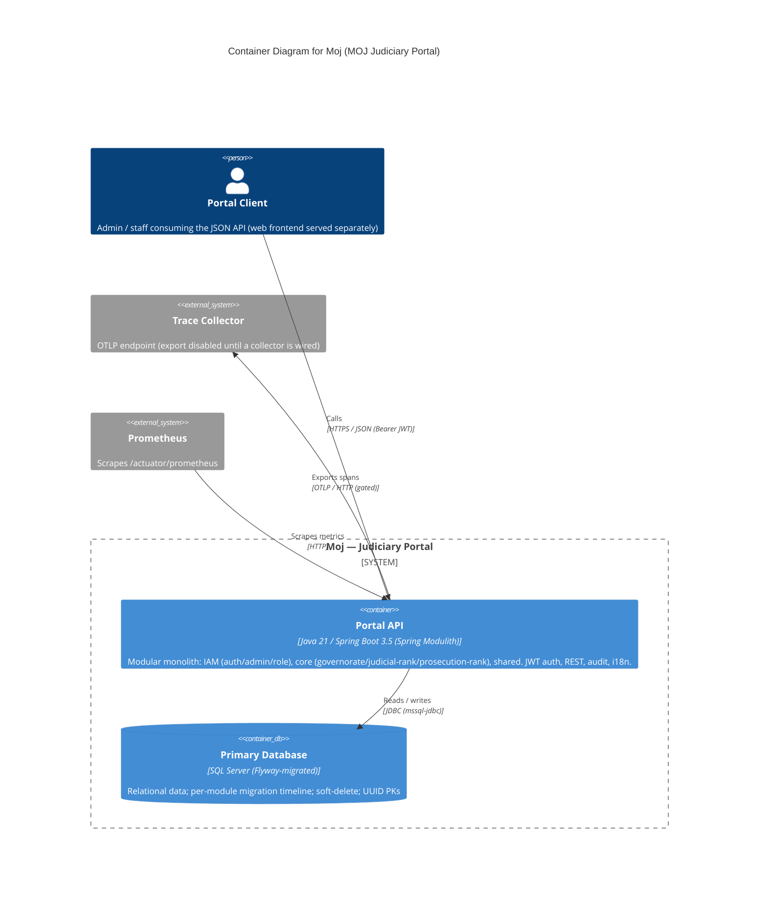

<!-- Source: ApexYard · templates/architecture/c4-container.md · github.com/me2resh/apexyard · MIT -->

# Container Diagram — Moj (MOJ Judiciary Portal)

> **C4 Level 2** — the system broken down into deployable/runnable containers. Audience: the dev team. One diagram per managed project; usually zoomed in from the L1 context diagram.

## Diagram

> **Note**: this diagram was auto-generated by /handover on 2026-06-08 from repo signals (pom.xml, compose.yaml, application.properties, Flyway migrations). It is a **starting point** — review and refine.
>
> - Container labels and tech strings — the detector may have picked a framework version wrong.
> - Inferred relationships — `user → api` assumes HTTPS with a Bearer JWT; adjust if your stack uses something else.
> - External systems — anything the portal uses that isn't in `pom.xml` / config (e.g. a separate web frontend at `localhost:3000` per the CORS default, an upstream identity provider, or MOJ infra dependencies) won't have been detected. Add the web frontend container if it lives in this system boundary.
>
> Update the "Maintenance" section below once the diagram is stable.

## Maintenance

(From the template — update when L2 containers change.)
