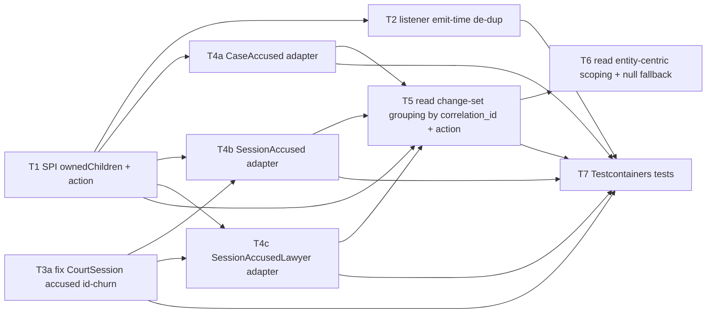

# Initiative — Change-Set Grouped Audit for Aggregate Child Collections

> **Scope**: Moj (`apessolutions/moj_judiciary`, base branch `development`) · **Quarter**: Q3 2026 · **Status**: planning

## Goal

Make the audit log capture child-table and nested-relation changes (court-session accused, their lawyers + charges; case accused) so an admin opens one entity's audit and sees a single grouped "change-set" view of what happened to that entity **and its children** — grouped by the existing per-request `correlation_id`, with each child entry tagged by its action.

## Success criterion

An admin viewing a court session's (or case's) audit sees, for any single edit, **one change-set** containing the parent's own field diff *and* every child diff (accused added/removed/modified, lawyer/charge changes) — each tagged `ADDED`/`REMOVED`/`UPDATED`, queryable by `(target_type, action)` — with no duplicate rows and no opaque-UUID churn.

## Approach (locked)

Per the Tech Lead spec (3 reviews) + CEO decisions:

- **Per-child `AuditAdapter`s** for entity-children (`CaseAccused`, `SessionAccused`, `SessionAccusedLawyer`).
- **New `AuditAdapter.ownedChildren()` SPI method** (recursive/nested) declaring parent→entity-child ownership; each declaration carries the **action dimension** so the read can query/tag by `(target_type, action)`.
- **Emit-time de-dup rule**: *membership belongs to the parent* (add/remove → parent collection-diff, child emits no CREATED/DELETED) / *field-state belongs to the child* (field edits → child's own UPDATED row). Value-collections (`chargeIds`) always ride on their owning entity's diff.
- **Stable-id in-place-merge fix** for the churned `court_session_accused` path (mints new ids every edit today). `case_accused` is already keyed — no fix.
- **Read-side change-set grouping** by the existing `correlation_id` (no schema migration), **queryable/filterable by `(target_type, action)`**, entity-centric scoping via `ownedChildren()`, null-correlation rows degrade to single-row change-sets.

Parent aggregates (CourtSession, Case) already audit their own scalar/FK changes today — unchanged; they only add `ownedChildren()` and get unioned with their children at read time.

## Anti-scope

- **DivisionPanel audit** — explicitly OUT (CEO decision 2026-06-19). Transient overwrite-in-place working state; the durable legal record lives in audited session judge-snapshots. Revisit only if a compliance need for panel-composition history emerges.
- **SessionJudge child audit adapter** — explicitly OUT. Judges are a frozen snapshot, never field-edited; the parent's membership-diff already tells the story. (CourtSession judge churn-fix therefore also dropped.)
- **`parent_type`/`parent_id` back-pointer column** — NOT now. Rely on the correlation-per-transaction invariant (documented + read-side `ownedChildren()` scoping guard); revisit via a Migration AgDR only if a multi-aggregate-per-request write path appears.
- Auth `Session` aggregate — deliberately unaudited (high-churn auth state), unchanged.

## Dependency DAG

## Recommended sequence (topo-sorted; ties by value × risk-inverse)

1. **T1** + **T3a** (parallel, no inbound deps; T3a is the P1 critical path — broken today, retro-fixes #90)
2. **T2**, **T4a** (depend only on T1)
3. **T4b**, **T4c** (depend on T1 + T3a)
4. **T5** (depends on T1 + T4a/b/c)
5. **T6** (depends on T5)
6. **T7** (depends on T2, T3a, T4a/b/c, T5)

## Milestones

### Milestone T1 — SPI: `ownedChildren()` + `ChildAudit` (action-aware) + registry indexing
- **Success criterion**: `AuditAdapter` exposes a recursive `ownedChildren()` returning `Map<childType, ChildAudit(targetType, relationField, action-semantics)>`; registry indexes membership-owned child types + `childTypesOf(parentType)`; no behaviour change yet. **Authors the change-set-audit AgDR (Gate 2) as its opening step.**
- **Blocks**: T2, T4a, T4b, T4c, T5
- **Blocked by**: none
- **Value**: High · **Risk**: Medium · **Confidence**: Medium
- **Filing**: Filed as [#103](https://github.com/apessolutions/moj_judiciary/issues/103)

### Milestone T2 — Listener: emit-time suppression (membership-vs-field de-dup)
- **Success criterion**: adding/removing an owned entity-child emits only the parent collection-diff (no child CREATED/DELETED); field edits emit only the child's UPDATED row; covers orphan-remove + soft-delete-as-exit; value-collections still ride on owner.
- **Blocks**: T7
- **Blocked by**: T1
- **Value**: High · **Risk**: Medium · **Confidence**: Medium
- **Filing**: Filed as [#105](https://github.com/apessolutions/moj_judiciary/issues/105)

### Milestone T3a — Fix CourtSession accused + lawyers id-churn (keyed in-place merge)
- **Success criterion**: editing a session updates accused/lawyers in place keyed on `caseAccusedId` (+ lawyer key), reusing existing ids; a name-only edit produces exactly one child UPDATED row, not a full-roster replace. **P1 — broken today; retro-fixes #90's audit output.**
- **Blocks**: T4b, T4c, T7
- **Blocked by**: none
- **Value**: High · **Risk**: Medium · **Confidence**: Medium
- **Filing**: Filed as [#104](https://github.com/apessolutions/moj_judiciary/issues/104)

### Milestone T4a — `CaseAccusedAuditAdapter` + `Case.ownedChildren()`
- **Success criterion**: case accused field changes (name/gender/charges) produce a `CaseAccused` UPDATED row; `CaseAuditAdapter` declares `accused` as an owned child. No churn fix (already keyed).
- **Blocks**: T5, T7
- **Blocked by**: T1
- **Value**: High · **Risk**: Low · **Confidence**: High
- **Filing**: Filed as [#106](https://github.com/apessolutions/moj_judiciary/issues/106)

### Milestone T4b — `SessionAccusedAuditAdapter` + `Session.ownedChildren()`
- **Success criterion**: session accused field changes produce a `SessionAccused` UPDATED row; `CourtSessionAuditAdapter` declares `accused` as an owned child.
- **Blocks**: T5, T7
- **Blocked by**: T1, T3a
- **Value**: High · **Risk**: Medium · **Confidence**: Medium
- **Filing**: Filed as [#107](https://github.com/apessolutions/moj_judiciary/issues/107)

### Milestone T4c — `SessionAccusedLawyerAuditAdapter` + nested `ownedChildren()`
- **Success criterion**: lawyer add/remove/field changes under a session accused are captured on the lawyer's own row; `SessionAccused` adapter declares `lawyers` as a nested owned child (proves recursive ownership).
- **Blocks**: T5, T7
- **Blocked by**: T1, T3a
- **Value**: Medium · **Risk**: Medium · **Confidence**: Medium
- **Filing**: Filed as [#108](https://github.com/apessolutions/moj_judiciary/issues/108)

### Milestone T5 — Read: change-set grouping endpoint (group by `correlation_id`, action-aware)
- **Success criterion**: new endpoint returns audit rows grouped by `correlation_id` as `{ changeSetId, occurredAt, actor, changes:[parent + child diffs] }`; the entity-centric query unions parent + owned descendants via `ownedChildren()`; **filterable/queryable by `(target_type, action)`** and each child entry tagged with its action.
- **Blocks**: T6, T7
- **Blocked by**: T1, T4a, T4b, T4c
- **Value**: High · **Risk**: Medium · **Confidence**: Medium
- **Filing**: Filed as [#109](https://github.com/apessolutions/moj_judiciary/issues/109)

### Milestone T6 — Read: entity-centric scoping guard + null-correlation fallback
- **Success criterion**: within a correlation group, only rows for the requested entity + declared descendants are unioned (defends against future multi-aggregate-per-request); rows with null `correlation_id` degrade to single-row change-sets.
- **Blocks**: T7
- **Blocked by**: T5
- **Value**: Medium · **Risk**: Low · **Confidence**: Medium
- **Filing**: Filed as [#110](https://github.com/apessolutions/moj_judiciary/issues/110)

### Milestone T7 — Testcontainers tests: de-dup, nested, action-tagged grouped read
- **Success criterion**: tests prove (a) name-only edit → one child UPDATED row, no churn; (b) add/remove → parent collection-diff only, no child CREATED/DELETED; (c) grouped read unions + tags actions correctly and filters by `(target_type, action)`; (d) nested lawyers; (e) null-correlation degrades per-row.
- **Blocks**: none
- **Blocked by**: T2, T3a, T4a, T4b, T4c, T5
- **Value**: High · **Risk**: Low · **Confidence**: Medium
- **Filing**: Filed as [#111](https://github.com/apessolutions/moj_judiciary/issues/111)

## Re-run history

| Date | Delta |
|------|-------|
| 2026-06-19 | Initial creation — 8 milestones (T1, T2, T3a, T4a, T4b, T4c, T5, T6, T7), scope=per-project (Moj). Refinements folded in: action-aware per-target_type query; session+case both covered. DivisionPanel + SessionJudge audit in Anti-scope. |
| 2026-06-19 | Filed all 9 milestones as #103 (T1), #104 (T3a), #105 (T2), #106 (T4a), #107 (T4b), #108 (T4c), #109 (T5), #110 (T6), #111 (T7) with blocks/blocked-by cross-refs. |
