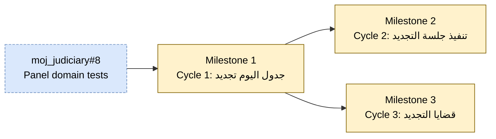

<!-- Source: ApexYard · templates/initiative.md · github.com/me2resh/apexyard · MIT -->

# Initiative: Detention Renewal (تجديد حبس)

**Status**: Draft
**Scope**: per-project (`Moj`)
**Quarter / Timeframe**: planning artefact + tickets filed by EOD 2026-06-16
**Owner**: Abdelrahman Shahda
**Created**: 2026-06-15
**Last Updated**: 2026-06-15

---

## Goal

Deliver the end-to-end **تجديد حبس** workflow in `moj_judiciary` — from composing the day's panel through executing renewal sessions to managing the resulting cases — for prosecutor, judge, court clerk, and defense lawyer.

## Success criterion

A prosecutor can file a renewal in Moj, the judge runs the session to a recorded قرار (تمديد N days / إخلاء سبيل), and the case is searchable in قضايا التجديد — with the panel-snapshot invariant ("save propagates to not-yet-started sessions only") preserved across mid-day swaps.

## Scope decision

This initiative is scoped as **per-project** (`Moj`). All 21 stories live in one Spring Modulith repo and touch overlapping aggregates (division / panel / case / session / accused / decision). Splitting across registered projects would fragment the bounded context.

Per-project initiative path: `projects/Moj/initiatives/detention-renewal.md`.

---

## Dependency graph

Legend: filed = green; unfiled = yellow; cancelled = red dashed; external blocker = blue dashed.

## Recommended sequence

Topologically sorted; ties broken by **value × risk-inverse**.

1. **Cycle 1: جدول اليوم (تجديد)** — depends on `moj_judiciary#8`; value H, risk M (score 3)
2. **Cycle 3: قضايا التجديد** — depends on Milestone 1; value M, risk L (score 3)
3. **Cycle 2: تنفيذ جلسة التجديد** — depends on Milestone 1; value H, risk H (score 2)

**Sequence rationale**: Milestone 1 is the unblocker — everything sits on its panel/case/session aggregates. Within the layer of {M2, M3} unblocked by M1, the formula sequences M3 first because it's lower-risk and ships value while M2's SME-confirmation gate (Webex scope, decision shape, transcript editability) is pending.

> ⚠ **Reality-check override the operator may want**: M2 is the load-bearing product moment (the actual courtroom session). M3 is a read/manage surface for cases that wouldn't be useful without M2 working. If SME confirmation on M2 lands quickly, run M2 and M3 in parallel; or override to M2-first if you want the courtroom flow proven before the management surface.

---

## Milestones

### Milestone 1 — Cycle 1: جدول اليوم (تجديد)

**Status**: filed
**Filing**: Filed as [#28](https://github.com/apessolutions/moj_judiciary/issues/28)
**Source stories**: 11 (US-RNW-DAY-A through K) — [Confluence](https://apessolutions.atlassian.net/wiki/spaces/MOJ/pages/1165754369)

- **Success criterion**: A user composes the day's panel (formation + delegated/additional judges + prosecutor) and adds sessions to the day's roll, with the panel snapshot propagating to not-yet-started sessions only (including mid-day swaps).
- **Blocks**: Milestone 2, Milestone 3
- **Blocked by**: `moj_judiciary#8` (Division / DivisionFormation / Panel domain tests — hard predecessor for stories A/B/F)
- **Kill criterion**: TBD — likely "the panel-snapshot semantics can't be enforced without a major aggregate refactor"
- **Value**: High
- **Risk**: Medium
- **Confidence in time estimate**: TBD

11 stories decomposing the day's panel + roll, page-per-story per the Moj Feature Definition Standard. The hard invariant ("save propagates to not-yet-started sessions only") gets its own story (DAY-F). Enabler tasks (block subsets of stories): تهمة lookup with add-on-the-fly de-dup, سبب النظر reference subset, قسم شرطة lookup, درجة قضائية + درجة عضو نيابة lookups, user-scoping (courts → user, divisions → user), and the predecessor domain tests in `moj_judiciary#8`. Pre-Ready gates: pin canonical سبب النظر value list (doc ≠ screens), decide سبب النظر placement (save-time vs search-step), confirm role assignment for the جدول اليوم screen.

### Milestone 2 — Cycle 2: تنفيذ جلسة التجديد

**Status**: filed
**Filing**: Filed as [#30](https://github.com/apessolutions/moj_judiciary/issues/30)
**Source stories**: 7 (US-RNW-RUN-A through G) — [Confluence](https://apessolutions.atlassian.net/wiki/spaces/MOJ/pages/1165983745) ⚠ inferred from prototype, needs SME

- **Success criterion**: A judge drives a renewal session from قيد العرض → قيد النطق بالقرار → تم النطق بالقرار, recording a per-accused قرار (تمديد N days / إخلاء سبيل) with the frozen panel snapshot, transcript, and PDF + edit-log output.
- **Blocks**: none (within this initiative)
- **Blocked by**: Milestone 1
- **Kill criterion**: TBD — likely "Webex/VC integration scope explodes beyond the cycle budget"
- **Value**: High
- **Risk**: High
- **Confidence in time estimate**: Low

7 stories for the virtual-courtroom screen — opened from M1's roll via US-RNW-DAY-K. Entire decomposition was inferred from prototype screenshots; SME confirmation gates every story to Ready. Pre-Ready open questions: (a) **Webex/VC integration** — real API, manual marker, or display-only (the single biggest scope/effort unknown in the whole track); (b) decision shape — per-accused vs per-session, is تمديد duration captured, what are the exact allowed قرار values; (c) transcript — free-text or structured, is it the legal record, editable after إنهاء الجلسة; (d) إضافة حاضر party types + mic-panel impact; (e) سجل التعديلات scope (likely surfaces the shared audit module); (f) confirm "no auto-scheduling of next renewal session" invariant; (g) who-may-run-session authority.

### Milestone 3 — Cycle 3: قضايا التجديد

**Status**: filed
**Filing**: Filed as [#29](https://github.com/apessolutions/moj_judiciary/issues/29)
**Source stories**: 3 (US-RNW-CASE-A through C) — [Confluence](https://apessolutions.atlassian.net/wiki/spaces/MOJ/pages/1165230082) ⚠ inferred from prototype, needs SME

- **Success criterion**: Users can list renewal cases (with search), view a case's header + sessions + accused, and edit case + manage accused — soft-delete only.
- **Blocks**: none
- **Blocked by**: Milestone 1 (reuses M1's case / accused / charge model — no re-spec)
- **Kill criterion**: TBD
- **Value**: Medium
- **Risk**: Low
- **Confidence in time estimate**: Medium

3 stories for the read/manage surface over renewal cases. Inferred from prototype; reuses M1's accused/charge model. Pre-Ready open questions: (a) edit scope — what's editable at case level vs locked (identity رقم/سنة/قسم/نوع); (b) إضافة متهم on details screen — same as M1 DAY-H, reuse don't re-spec; (c) list scope — system-wide vs user-scoped (only رقم القضية + قسم الشرطة search visible); (d) can-you-open-a-session-from-details into Cycle 2; (e) confirm soft-delete rule applies at case level.

---

## Open uncertainties

Rolled up from per-milestone `TBD` answers and the source-doc open questions. Each entry names the milestone + the question that was deferred.

- **M1 — kill criterion**: TBD (2026-06-15)
- **M1 — confidence in time estimate**: TBD (2026-06-15)
- **M1 — open decision**: pin canonical سبب النظر value list (doc lists 3 values, screens show 2)
- **M1 — open decision**: سبب النظر placement (save-time field vs search-step field)
- **M1 — open decision**: role assignment for the جدول اليوم screen
- **M2 — kill criterion**: TBD (2026-06-15)
- **M2 — Webex/VC integration scope**: real API vs manual marker vs display-only (biggest scope unknown)
- **M2 — decision shape**: per-accused vs per-session, duration captured?, allowed قرار values
- **M2 — transcript**: free-text vs structured; legal record status; post-إنهاء editability
- **M2 — إضافة حاضر**: party types + mic-panel impact
- **M2 — سجل التعديلات**: scope vs shared audit module
- **M2 — invariant**: confirm "no auto-scheduling of next renewal session"
- **M2 — authority**: who may run a session (start/end, decision recording, transcript editing)
- **M3 — kill criterion**: TBD (2026-06-15)
- **M3 — edit scope**: case-level editable vs locked identity fields
- **M3 — list scope**: system-wide vs user-scoped, pagination
- **M3 — interaction**: can you open a session from case details into Cycle 2?
- **M3 — invariant**: confirm soft-delete cascade at case level

---

## Anti-scope

Things this initiative explicitly will NOT do.

- **Auto-scheduling of the next renewal session** (parent-page invariant — confirm with SME at M2)
- **Hard delete** anywhere in the track (soft-delete only, including cascade to created case in M1 US-RNW-DAY-K)
- **Cross-court / cross-division session visibility** beyond the user-scoping rule (M1 enabler)
- **Re-specification of accused/charge/case model** in M3 — explicit reuse of M1's aggregates
- **Replacing the existing single-page version** (جدول اليوم تجديد by Ziad Kamal) — left intact alongside the page-per-story split

---

## Re-run history

Append-only. Each `/plan-initiative` re-run on this slug adds one entry.

| Date | Delta |
|------|-------|
| 2026-06-15 | Initial creation — 3 milestones, scope=per-project (Moj). Sourced from Mariam + Iman's 2026-06-08 Confluence decomposition (21 stories across 3 cycles per the Moj Feature Definition Standard). |
| 2026-06-15 | Filed milestones M1, M3, M2 as #28, #29, #30 (topo order). Pass 2 wrote Blocks/Blocked-by cross-refs. |
| 2026-06-15 | Filed 21 story-level tickets as `[Feature]` under each milestone: M1 stories #31–#41 (11), M3 stories #42–#44 (3), M2 stories #45–#51 (7). Each milestone updated with a child-story checklist. Each story body links to its Confluence page (page-per-story remains source-of-truth for ACs). |
