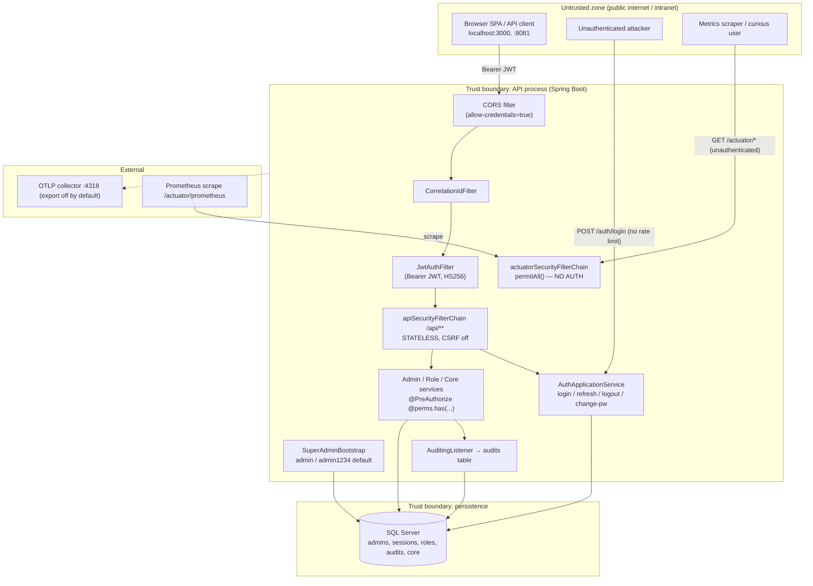

# Threat Model — Moj (MOJ Judiciary Portal backend)

> STRIDE threat model. In the context of a Spring Boot 3.5 / Java 25 hexagonal-DDD
> judiciary portal backend secured with JWT + Spring Security, facing an
> internet-or-intranet-exposed REST API that administers judicial reference data and
> admin identities, I enumerated threats per trust boundary to prioritise hardening
> before production.

- **Target**: `workspace/Moj/backend`, branch `development`, commit `27624a4`
- **Stack**: Java 25 · Spring Boot 3.5.14 · Spring Modulith · jMolecules DDD · SQL Server + Flyway · Spring Security + jjwt (HS256)
- **Date**: 2026-06-08
- **Method**: STRIDE per trust-boundary crossing + OWASP cross-check. Evidence is `file:line`.
- **Scope note**: The framework `/threat-model` skill normally consumes a `/dfd`
  artefact; none exists for this newly-adopted repo, so the DFD below was authored
  inline from a direct code read. This is a deviation from the skill's "refuse
  without DFD" rule, taken deliberately because the task directs a standalone audit.

---

## Trust-boundary overview

### Trust boundaries

| # | Boundary crossing | Auth at the boundary | Data classification |
|---|---|---|---|
| B1 | Untrusted client → `/api/v*/auth/login`, `/auth/refresh` | **None** (permitAll) | credentials, refresh tokens (secret) |
| B2 | Untrusted client → all other `/api/**` | Bearer JWT (HS256) + `@PreAuthorize` | admin PII, judicial reference data |
| B3 | Untrusted client → `/actuator/**` | **None** (permitAll all endpoints) | health detail, metrics, modulith map (internal) |
| B4 | App services → SQL Server | JPA/Hibernate (Spring Data) | all persisted data at rest |
| B5 | App → OTLP collector :4318 | export disabled by default | traces (potential PII in spans) |
| B6 | Bootstrap seeder → admins table | startup, in-process | super-admin credential |

### Data classifications

| Data | Classification | Where |
|---|---|---|
| Admin password | Secret — BCrypt hash at rest | `admins.password_hash` |
| Refresh token | Secret — SHA-256 hash at rest, raw only in transit | `sessions.refresh_token_hash` |
| Access token (JWT) | Bearer secret — HS256 signed, not stored | issued per request |
| JWT signing secret | Secret — symmetric HS256 key | `app.security.jwt.secret` |
| Admin identity / roles / PII | Confidential | `admins`, `admin_roles`, `roles` |
| Judicial reference data | Internal/confidential | `core` tables |
| Audit log | Confidential, integrity-sensitive | `audits` |

---

## Findings summary

| Severity | Count |
|---|---|
| Critical | 1 |
| High | 4 |
| Medium | 6 |
| Low | 4 |

| # | STRIDE | Threat | Severity | Boundary | Evidence |
|---|---|---|---|---|---|
| T1 | Spoofing / EoP | Insecure default super-admin (`admin`/`admin1234`) + placeholder JWT secret ship enabled by default (issue #1) | **Critical** | B6, B1 | `application.properties:21,47-49` |
| T2 | DoS / Spoofing | No rate limiting / lockout on `/auth/login` or `/auth/refresh` → unthrottled credential brute force | **High** | B1 | no limiter in codebase; `SecurityConfig.java:59` |
| T3 | Info disclosure / EoP | All actuator endpoints `permitAll()` — `/actuator/prometheus`, `/metrics`, `/modulith`, `/info` reachable unauthenticated | **High** | B3 | `SecurityConfig.java:40-43`; `application.properties:31` |
| T4 | Tampering / Info disc | No transport-security enforcement (no HSTS, no `requiresChannel(secure)`) — relies entirely on external TLS termination | **High** | B1, B2 | no TLS config in `src/main` |
| T5 | Spoofing | `X-Forwarded-For` trusted verbatim for client IP with no trusted-proxy allowlist → audit-log / session IP spoofing | **High** | B1, B2 | `AuthController.java:107-113`; `DefaultAuditContextProvider.java:46-56` |
| T6 | Spoofing / EoP | Weak password policy: 8-char minimum, no complexity / breach check; default seed password is 9 chars and predictable | **Medium** | B6, B2 | `ChangePasswordRequest.java:14`; `RegisterAdminRequest.java:29` |
| T7 | DoS | Effective-permissions resolved from DB on **every** authenticated request (no cache) → amplifies load and is a per-request DB dependency | **Medium** | B2 | `JwtAuthFilter.java:84`; `EffectivePermissionsUseCase` |
| T8 | Repudiation | Login, logout, refresh and **failed-login** attempts are deliberately not audited → brute-force / unauthorized-access attempts leave no trail | **Medium** | B1 | `AuthApplicationService.java:36-41` (class doc) |
| T9 | Info disclosure | CORS `allow-credentials=true` with a configurable origin list; a misconfigured/over-broad `APP_CORS_ORIGINS` in prod exposes credentialed cross-origin access | **Medium** | B1, B2 | `application.properties:25,28`; `CorsConfig.java:17-20` |
| T10 | Info disclosure | `app.errors.include-stack` can be flipped on in any env via env var, leaking stack traces in 500 bodies | **Medium** | B2 | `GlobalExceptionHandler.java:173-176`; `application.properties:62` |
| T11 | DoS | No global request-body size cap beyond servlet defaults; no explicit `@Size` ceiling on `username`/`password` login fields | **Medium** | B1, B2 | `LoginRequest.java:8-13` |
| T12 | Repudiation | `audits` table is not enforced append-only at the DB layer (no triggers/permissions); a DB-level actor or SQL-injection-equivalent could tamper history | **Low** | B4 | `V0_001__create_audits.sql` |
| T13 | Spoofing | JWT access token TTL is 1 day (`P1D`); access tokens cannot be revoked before expiry (only refresh tokens are session-bound) | **Low** | B2 | `application.properties:23`; `JwtService.java:52-59` |
| T14 | Info disclosure | `health.show-details=when_authorized` but the actuator chain authenticates no one → details effectively gated only by the `when_authorized` fallback, not by a real principal | **Low** | B3 | `application.properties:32`; `SecurityConfig.java:42-43` |
| T15 | Tampering | HS256 symmetric JWT: anyone with the signing secret can mint valid admin tokens; secret is shared app-wide and only as strong as its storage | **Low** | B2 | `JwtService.java:33,47` |

---

## Detailed findings

### T1 — Insecure default super-admin + placeholder JWT secret (CRITICAL) — issue #1
The bootstrap seeder is **enabled by default** (`APP_BOOTSTRAP_SUPER_ADMIN_ENABLED:true`)
and defaults to `admin` / `admin1234` (`application.properties:47-49`). The JWT signing
secret defaults to the literal placeholder `change-me-please-use-a-32-byte-minimum-secret`
(`application.properties:21`). If either default reaches a running environment, an attacker
(a) logs in as a full super-admin who bypasses every `@perms` check
(`Permissions.java:32`, `JwtAuthFilter.java:86-88`), or (b) forges arbitrary admin JWTs
offline because the symmetric HS256 key is publicly known (`JwtService.java:33`). This is
total compromise of the IAM boundary.
**Mitigation**: make the app refuse to start when either value equals its placeholder
(fail-fast `@PostConstruct`/`EnvironmentPostProcessor` check); require `APP_SECURITY_JWT_SECRET`
and a strong `APP_BOOTSTRAP_SUPER_ADMIN_PASSWORD` to be explicitly set in any non-local
profile; force a password change on first super-admin login; disable the seeder after first run.

### T2 — No rate limiting on authentication (HIGH)
`/auth/login` and `/auth/refresh` are `permitAll()` (`SecurityConfig.java:59`) and there is
no rate limiter, account lockout, or CAPTCHA anywhere in the codebase (grep for
bucket4j/resilience4j/RateLimiter returned nothing). Credential brute force, refresh-token
guessing, and login-flood DoS are unthrottled. `lookupByUsername` correctly avoids
user-enumeration timing (`AuthApplicationService.java:159-172`), but that only matters once
brute force is bounded.
**Mitigation**: add a per-IP + per-username limiter (e.g. Bucket4j 5/min/IP on `/auth/**`)
at the filter level; add exponential backoff / temporary lockout after N failures; consider
a WAF/gateway limit in front.

### T3 — Actuator endpoints fully unauthenticated (HIGH)
`actuatorSecurityFilterChain` matches every actuator endpoint and `anyRequest().permitAll()`
with CSRF off (`SecurityConfig.java:40-43`). Exposed endpoints include `prometheus`, `metrics`,
`modulith`, `info`, `health` (`application.properties:31`). Unauthenticated callers can read
operational metrics (request volumes, JVM internals), the full module structure (`modulith`),
and build/info metadata — valuable reconnaissance, and `prometheus`/`metrics` can leak request
patterns and tenant/usage data.
**Mitigation**: restrict the actuator chain to `EndpointRequest.to("health","info").permitAll()`
and `.anyRequest().authenticated()` (or `hasAuthority(SUPER_ADMIN)`) for the rest; scrape
`prometheus` over an internal-only network interface or with a scrape credential.

### T4 — No transport-security enforcement (HIGH)
There is no `requiresChannel().requiresSecure()`, no HSTS header configuration, and no
`server.ssl` in `src/main`. Bearer JWTs, refresh tokens, and credentials cross B1/B2 in
cleartext unless an external load balancer terminates TLS and is correctly configured. A
downgrade or a missing edge-TLS config exposes every secret in transit.
**Mitigation**: enforce HTTPS at the app (HSTS via Spring Security headers; `requiresSecure`
when not behind a trusted TLS-terminating proxy), document the TLS-termination requirement,
and set `server.forward-headers-strategy=framework` only with a trusted proxy (see T5).

### T5 — Unvalidated `X-Forwarded-For` (HIGH for audit integrity)
Both the login path (`AuthController.java:107-113`) and the audit context
(`DefaultAuditContextProvider.java:46-56`) take the first `X-Forwarded-For` value verbatim
with no trusted-proxy allowlist. Any client can spoof its source IP, poisoning the audit
trail (repudiation) and the session device metadata, and defeating any IP-based controls
added later.
**Mitigation**: only honour `X-Forwarded-For` when the immediate peer is a known proxy
(Spring `ForwardedHeaderFilter` + trusted-proxy CIDR), otherwise use `getRemoteAddr()`.

### T6 — Weak password policy (MEDIUM)
Minimum password length is 8 with no complexity, no breach-list check, and no maximum length
(`ChangePasswordRequest.java:14`, `RegisterAdminRequest.java:29`). The default seed password
`admin1234` (T1) is a trivially guessable 9-char string. For a judiciary admin portal this is
under-strength.
**Mitigation**: raise the minimum (e.g. 12+), add complexity / breached-password screening,
cap length to bound BCrypt cost, and forbid known-weak values.

### T7 — Per-request DB permission resolution, no cache (MEDIUM)
`JwtAuthFilter` resolves effective permissions from storage on every authenticated request
(`JwtAuthFilter.java:84`). This is a deliberate freshness tradeoff (role changes apply next
request), but it makes every request a DB round-trip and an amplification target under load.
**Mitigation**: add a short-TTL per-admin permission cache (e.g. 30–60s) with explicit
invalidation on role change, or accept the cost but ensure connection-pool limits + T2 rate
limiting bound the blast radius.

### T8 — Auth events not audited (MEDIUM)
By design, login / logout / refresh / **failed login** are not recorded; only
`TOKEN_REUSE_DETECTED` and `PASSWORD_CHANGED` are (`AuthApplicationService.java` class doc,
`:96-103`, `:155-156`). For a justice-sector system this leaves no record of who accessed it
or of brute-force attempts — a repudiation and incident-response gap.
**Mitigation**: audit successful and failed authentication (at minimum failed-login with
source IP and username), even if sampled/aggregated, to a tamper-evident store.

### T9 — Credentialed CORS with configurable origins (MEDIUM)
`allow-credentials=true` (`application.properties:28`) combined with an env-driven origin list
(`CorsConfig.java:17`) means a wrong `APP_CORS_ORIGINS` (or a future wildcard) grants
credentialed cross-origin access. The code correctly uses an explicit origin list (not `*`),
so this is a config-hygiene risk, not a present flaw.
**Mitigation**: validate at startup that origins are explicit HTTPS hosts (reject `*` and
plain-http in prod); document that `allow-credentials` forbids wildcard.

### T10 — Stack-trace exposure togglable per env (MEDIUM)
`app.errors.include-stack` defaults off (`application.properties:62`) but any operator can set
`APP_ERRORS_INCLUDE_STACK=true` and 500 bodies then carry full traces
(`GlobalExceptionHandler.java:173-176`). Defaults are safe; the risk is operational misuse in
a shared env.
**Mitigation**: hard-gate this to non-prod profiles (ignore the flag when
`spring.profiles.active` is prod), or remove from response entirely and rely on server-side logs.

### T11 — No explicit input-size ceilings (MEDIUM)
Login fields have `@NotBlank` only, no `@Size` max (`LoginRequest.java:8-13`); there is no
configured max request body size beyond servlet defaults. Large-payload and oversized-field
DoS are possible.
**Mitigation**: add `@Size(max=...)` to auth/request DTOs and set
`spring.servlet.multipart.max-request-size` / a body-size limit.

### T12 — Audit table not DB-enforced append-only (LOW)
`audits` is a plain table (`V0_001__create_audits.sql`) with no trigger/permission preventing
UPDATE/DELETE. Application code only appends, but a compromised DB account could rewrite history.
**Mitigation**: revoke UPDATE/DELETE on `audits` from the app DB role, or add an
INSTEAD-OF-UPDATE/DELETE trigger; consider periodic export to write-once storage.

### T13 — 1-day access-token TTL, no early revocation (LOW)
Access TTL is `P1D` (`application.properties:23`) and access tokens are stateless
(`JwtService.java`), so a stolen access token is valid for up to 24h regardless of logout.
Refresh-token rotation + reuse detection (`AuthApplicationService.java:97-104`) is strong, but
the access window is wide.
**Mitigation**: shorten access TTL (e.g. 15–30 min) and rely on refresh rotation; optionally
add a token-version/denylist check for forced revocation.

### T14 — `health.show-details=when_authorized` with no actuator auth (LOW)
Details show `when_authorized`, but the actuator chain authenticates no principal (T3), so the
setting's protective intent is not actually exercised.
**Mitigation**: resolved by T3 (authenticate the actuator chain), after which `when_authorized`
behaves as intended.

### T15 — Symmetric HS256 signing (LOW)
HS256 uses one shared secret to both sign and verify (`JwtService.java:33,47`). Anyone holding
the secret can forge tokens; there is no key rotation or asymmetric verification.
**Mitigation**: ensure the secret is high-entropy and stored in a secrets manager; consider
RS256/ES256 if verification ever needs to be delegated, and define a key-rotation procedure.

---

## OWASP cross-check

| Check | Status | Note |
|---|---|---|
| SQL injection | **Pass** | Spring Data JPA + `Specification`s throughout; no string-concatenated SQL found |
| XSS | **N/A** | API-only backend, JSON responses; no server-side HTML rendering |
| Insecure deserialization | **Pass** | Jackson into typed DTOs with Bean Validation; no polymorphic/`enableDefaultTyping` |
| Default credentials | **FAIL** | T1 — `admin`/`admin1234` + placeholder JWT secret enabled by default |
| Security misconfiguration | **FAIL** | T3 (actuator open), T4 (no TLS enforcement), T9 (CORS), T10 (stack toggle) |
| Secrets in code | **Pass (with caveat)** | Secrets are env-overridable; the *defaults* are the problem (T1), not committed real secrets |
| Broken auth / session | **Partial** | Strong refresh rotation + reuse detection + SHA-256 token hashing; weakened by T2/T6/T13 |
| Sensitive data in logs/audit | **Pass** | Audit snapshots explicitly exclude password hashes & tokens (`AdminAuditAdapter` doc, CLAUDE.md) |
| Authorization (IDOR/EoP) | **Pass** | Every mutating/admin endpoint carries `@PreAuthorize @perms.has(...)` (`AdminController.java:77-113`); authorities resolved server-side per request |
| Rate limiting | **FAIL** | T2 — none present |

---

## Prioritised remediation

1. **T1 (Critical)** — fail-fast on placeholder JWT secret + default super-admin creds; force first-login password change. **Blocks production.**
2. **T2 (High)** — add login/refresh rate limiting + lockout.
3. **T3 (High)** — authenticate non-`health`/`info` actuator endpoints.
4. **T4 (High)** — enforce HTTPS/HSTS; document TLS-termination contract.
5. **T5 (High)** — trusted-proxy allowlist for `X-Forwarded-For`.
6. **T6–T11 (Medium)** — password policy, permission cache, auth auditing, CORS startup validation, prod-gate stack traces, input-size caps.
7. **T12–T15 (Low)** — append-only audits, shorter access TTL, actuator-auth follow-through, JWT key hygiene/rotation.

---

## What I could not verify

- **Runtime config**: no deployed `application-prod.properties` / env manifests were available, so I assessed defaults and env-var wiring, not the actual production values. T1/T9/T10 severity assumes defaults can leak to prod — confirm the deployment overrides.
- **Edge/infra controls**: any WAF, API gateway, reverse-proxy rate limiting, or TLS termination outside the repo would mitigate T2/T4 but is invisible here.
- **DB hardening**: actual DB role grants/permissions on `audits` (T12) were not inspected — only the Flyway DDL.
- **Dependency CVEs**: no `pom.xml` dependency-vulnerability scan was run as part of this STRIDE pass; recommend a separate `/audit-deps`.
- **No DFD artefact** existed; the trust-boundary model was authored inline from the code and was not cross-checked against a `/dfd` run.
