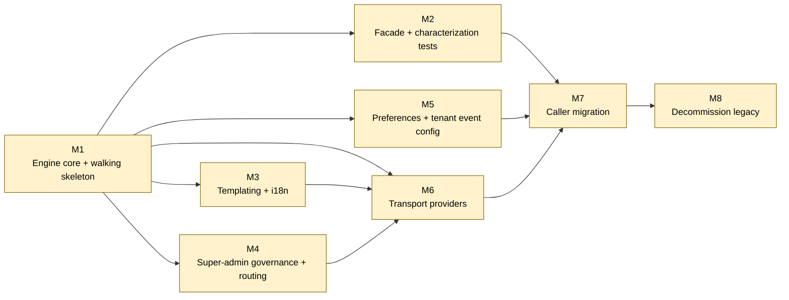

<!-- Based on ApexYard · templates/initiative.md · github.com/me2resh/apexyard · MIT -->

# Initiative: Notifications Routing & Preferences Engine

**Status**: Draft
**Scope**: per-project (`booking-system`)
**Quarter / Timeframe**: No fixed date
**Owner**: Abdelrahman Shahda
**Created**: 2026-06-28
**Last Updated**: 2026-06-28

---

## Goal

Replace Spark's caller-driven notification path with a resolution engine that honors super-admin transport governance, tenant event configuration, and per-recipient preferences — so new transports (incl. WhatsApp) and per-event recipient control ship without callers ever choosing a transport or hardcoding copy.

## Success criterion

All ~32 call sites migrated to the semantic `notify()` facade, the legacy hardcoded-string path deleted, and ≥1 tenant live in production with per-event recipient preferences and at least one non-push transport (WhatsApp/SMS) — with zero notification-loss incidents for 14 consecutive days post-cutover.

## Scope decision

This initiative is scoped as **per-project (`booking-system`)**. The work is entirely contained in `libs/notification` plus its ~32 consumers across the booking-system monorepo; no other registered project shares this notification layer. Rationale + full design: `projects/booking-system/techdesign-notifications-engine.md`.

---

## Dependency graph

Legend: filed = green; unfiled = yellow; cancelled = red dashed.

## Recommended sequence

Topologically sorted over the DAG above; ties broken by **value × risk-inverse** (high-value, low-risk milestones come first within a topological layer).

1. **M1 — Engine core + walking skeleton** — no inbound deps; value H, risk M
2. **M3 — Templating + i18n** — depends on M1; value M, risk L
3. **M4 — Super-admin governance + routing** — depends on M1; value H, risk M
4. **M5 — Preferences + tenant event config** — depends on M1; value H, risk M
5. **M2 — Facade + characterization tests** — depends on M1; value H, risk H
6. **M6 — Transport providers** — depends on M1, M3, M4; value H, risk M
7. **M7 — Caller migration** — depends on M2, M5, M6; value M, risk M
8. **M8 — Decommission legacy** — depends on M7; value M, risk L

**Sequence rationale**: M1 is the sole unblocker — the resolution pipeline must exist before anything reads from it, so it's the topo head. M3/M4/M5 form an independent layer once M1 lands (none depends on the others) and are the natural **fan-out point**. The value×risk-inverse tie-break sorts M3 ahead within that layer (low risk) and pushes M2 to the end of the layer (its High risk — ~32 untreated call sites — lowers its score), **but** M2 is independent of M3/M4/M5 and de-risks the entire migration, so in practice it should be pulled forward to run in parallel with M3–M5 rather than waiting. M6 needs both templates (M3) and transport governance (M4). M7 is the convergence point requiring the facade (M2), the preference/config reads (M5), and the providers (M6). M8 is the cleanup tail.

---

## Milestones

### Milestone 1 — Engine core + walking skeleton

**Status**: unfiled
**Filing**: unfiled

- **Success criterion**: One event (`BOOKING_COMPLETED`) resolves end-to-end through all 7 pipeline steps (tenant-active → preference → route → enablement-filter → render → dispatch → record) on the PUSH transport, behind the new engine, with the legacy path untouched.
- **Blocks**: Facade + characterization tests, Templating + i18n, Super-admin governance + routing, Preferences + tenant event config, Transport providers
- **Blocked by**: none
- **Kill criterion**: Resolution-pipeline latency or complexity proves untenable for the per-send read cost (e.g. routing+preference lookups can't be cached to acceptable p95).
- **Value**: High
- **Risk**: Medium
- **Confidence in time estimate**: TBD

Stand up `ResolutionService`, the repository ports (preference, tenant event config, transport routing, transport enablement), and a `Dispatcher` calling the push provider behind `INotificationProvider`, plus the universal `RecordWriter`. Thinnest possible vertical slice — one event, PUSH transport — but every pipeline stage real, including the feed-record render (Tariq NEW-2). This is the seam everything else grows on; build it as a `/walking-skeleton` (kept, full SDLC, no exemptions).

### Milestone 2 — Facade + characterization tests

**Status**: unfiled
**Filing**: unfiled

- **Success criterion**: `sendUserNotification`/`sendAdminNotification` reimplemented to build a `NotificationIntent` and call `notify()`; behaviour for all un-migrated callers is byte-identical (default routing = push, all events mandatory), proven by characterization tests written against the *current* behaviour before the swap.
- **Blocks**: Caller migration
- **Blocked by**: Engine core + walking skeleton
- **Kill criterion**: Current behaviour can't be characterized reliably (non-deterministic sends) — would force per-caller manual verification instead.
- **Value**: High
- **Risk**: High
- **Confidence in time estimate**: TBD

The strangler seam. Lock the existing notification behaviour in tests (the lib has **zero** today), then route the old public API through the new engine without changing any caller. De-risks the entire migration — should run in parallel with M3–M5 despite the tie-break ordering.

### Milestone 3 — Templating + i18n

**Status**: unfiled
**Filing**: unfiled

- **Success criterion**: `notification_template` table + `TemplateRenderer` render title/body/payload from `(event, transport, locale)` (incl. the `IN_APP` render target) with locale fallback (recipient → tenant default → platform default); at least the booking event family's strings migrated out of handler code.
- **Blocks**: Transport providers
- **Blocked by**: Engine core + walking skeleton
- **Kill criterion**: none anticipated.
- **Value**: Medium
- **Risk**: Low
- **Confidence in time estimate**: TBD

Versioned templates keyed by event×transport×locale, replacing the hardcoded strings scattered across the handlers. Includes the migration for the template table (`/migration` — gate 3a).

### Milestone 4 — Super-admin governance + routing

**Status**: unfiled
**Filing**: unfiled

- **Success criterion**: Super-admin can (a) enable/disable a transport per tenant with disable being **irreversible**, and (b) configure **ordered routing rules** (transport + closed-catalog predicate + FIRST_MATCH/ALL_MATCH strategy) per event (global default + per-tenant override), via the platform-admin APIs; resolution pipeline evaluates rules per send.
- **Blocks**: Transport providers
- **Blocked by**: Engine core + walking skeleton
- **Kill criterion**: none anticipated.
- **Value**: High
- **Risk**: Medium
- **Confidence in time estimate**: TBD

`tenant_transport_enablement` (irreversible disable) + `event_transport_routing` tables and their admin APIs. This is the actor-ownership boundary that keeps transport choice with the platform, never the tenant or recipient. Mandatory events are not tenant-disable-able (NEW-1). Migrations via `/migration`.

### Milestone 5 — Preferences + tenant event config

**Status**: unfiled
**Filing**: unfiled

- **Success criterion**: Recipient admins toggle per-event delivery for themselves (mandatory events read-only server-side); tenants configure which events are active + timing rules (e.g. "remind 2h before cancellation deadline"); both surfaces have authz-scoped APIs and feed the resolution pipeline.
- **Blocks**: Caller migration
- **Blocked by**: Engine core + walking skeleton
- **Kill criterion**: none anticipated.
- **Value**: High
- **Risk**: Medium
- **Confidence in time estimate**: TBD

`notification_preference` (per-event, per-recipient) + `tenant_event_config` (active events + timing rules) tables and APIs. The two surfaces that satisfy the original asks ("settings per admin" + "tenant defines events"). Security-sensitive — recipient endpoints must be scoped to the authenticated principal (IDOR); extend the existing tenantId filter pattern, not CASL. Migrations via `/migration`.

### Milestone 6 — Transport providers (was "Channel providers")

**Status**: unfiled
**Filing**: unfiled

- **Success criterion**: WhatsApp (Twilio, dispatching a pre-approved content-template SID), SMS (Twilio), and in-app (DB feed) providers all implement `INotificationProvider` behind the registry; dispatch has retry + dead-letter on failure.
- **Blocks**: Caller migration
- **Blocked by**: Engine core + walking skeleton, Templating + i18n, Super-admin governance + routing
- **Kill criterion**: Twilio WhatsApp integration blocked by off-platform template-approval issues that can't be resolved in the planned window.
- **Value**: High
- **Risk**: Medium
- **Confidence in time estimate**: TBD

Per-transport providers behind the port, plus reliability (retry + DLQ — absent today, errors are only logged). WhatsApp template approval is handled off-platform; the provider only dispatches against a known SID and fails loud on an unknown one. Needs templates (M3) and routing/enablement (M4) to be meaningful.

### Milestone 7 — Caller migration

**Status**: unfiled
**Filing**: unfiled

- **Success criterion**: All ~32 call sites across booking, open-matches, tournament, campaign, and user domains emit `NotificationIntent` via `notify()` instead of the legacy API; characterization tests stay green throughout.
- **Blocks**: Decommission legacy
- **Blocked by**: Facade + characterization tests, Preferences + tenant event config, Transport providers
- **Kill criterion**: none — but if rework spikes, slow the per-domain cadence rather than abandon.
- **Value**: Medium
- **Risk**: Medium
- **Confidence in time estimate**: TBD

Migrate one event-family at a time (booking → open-matches → tournament → campaign → user). Repetitive and verifiable per slice — the prime **`/fan-out`** candidate once the skeleton + facade hold. Each slice gated by green characterization tests + Rex. (~32 call sites, confirmed by Tariq's grep; the scout's initial 96 was an overcount of import-usages.)

### Milestone 8 — Decommission legacy

**Status**: unfiled
**Filing**: unfiled

- **Success criterion**: Legacy hardcoded-string handlers removed, duplicate `BaseNotificationsService` registration in `spark-tenant-admin-api` collapsed into the single `NotificationModule` export, dead seeder removed; no references to the old send path remain.
- **Blocks**: none
- **Blocked by**: Caller migration
- **Kill criterion**: none.
- **Value**: Medium
- **Risk**: Low
- **Confidence in time estimate**: TBD

The cleanup tail — only safe once every caller is on `notify()`. Deletes the strangler scaffolding and the pre-existing duplication/dead code the scout flagged.

---

## Open uncertainties

Rolled up from per-milestone `TBD` answers + design open questions.

- **All milestones — confidence in time estimate**: TBD (2026-06-28) — estimation deferred to per-milestone `/start-ticket` flow.
- **M6 — cost-control on multi-transport sends**: **RESOLVED (rev 3, AgDR-0020)** — per-event `strategy`: FIRST_MATCH = ordered fallback (cost control), ALL_MATCH = multi-send. Routing is now conditional rules with closed-catalog predicates.
- **M1 — `BOOKING_COMPLETED` catalog key**: confirm vs current `AUTOMATED` event value (Tariq NIT1) — resolve when building the walking skeleton.
- **Design ratification (complete)**: AgDR-0014 (per-event, opt-out default), 0015 (transport = platform-only), 0016 (irreversible disable + in-app floor), 0017 (strangler), 0018 (Transport/Audience split), 0019 (timing-rule execution), **0020 (conditional routing rules)** — all in `docs/agdr/`. Design at rev 3 (conditional routing + Hakim H1/H2 security findings). Landed as PR #761.

---

## Design-review follow-ups (advisory — settle during Build, not design-blocking)

From the rev-3 re-reviews (Tariq + Hakim, 2026-06-28). All non-blocking; the gates passed. Carry into the named milestone.

**Settle in M1 (walking skeleton):**

- **Fail-closed predicates** — absent context key ⇒ predicate evaluates FALSE (never accidentally routes). [Hakim]
- **Deny-by-default predicate parser** — unknown predicate kind ⇒ reject, not ignore; scalar-equality comparison only. [Hakim]
- **Feed-record fallback render** (NEW-2 "render from context") must route through the same HTML-escape as IN_APP — same stored-XSS sink. [Hakim]
- **A2 — predicate-input batching**: `recipient.hasDevice/hasPhone` need per-recipient lookups at step [3]; extend NFR batching + the cacheability kill-criterion to predicate inputs (N+1 guard at fan-out). [Tariq]
- **A5 governance**: `order` uniqueness/tie-break per (scope,event); tenant-override-vs-global replace-vs-merge semantics; value-domain validation for `context.<key>==<value>` (typo'd values silently never match). [Tariq]
- **A3 — strategy invariant**: `strategy` is per-event but stored per-rule-row → config-time invariant "all rules of (scope,event) share one strategy" (or hoist to parent). [Tariq]

**Settle in M4/M5 (governance + config surfaces):**

- **Server-derived predicate keys only** — mark routing-eligible vs render-only keys in the catalog so a user can't influence `context.source` to force/avoid a paid transport (cost amplification / transport steering). [Hakim NEW MEDIUM]
- **FIRST_MATCH confidentiality** — rule ordering is a confidentiality decision (PUSH→SMS downgrade); document per-event whether downgrade is acceptable. [Hakim]
- **PII-at-rest retention (GDPR)** — concrete erasure/retention policy over persisted `rendered_body`/`payload`/DLQ; right-to-be-forgotten obligation. File a dedicated ticket. [Hakim PARTIAL]

**Doc hygiene (non-urgent):**

- **A4** — add a "static-set aspect superseded by AgDR-0020" forward banner to AgDR-0015 (supersession already captured in AgDR-0020 + the Ownership Model). [Tariq]

## Anti-scope

Things this initiative explicitly will NOT do:

- WhatsApp template **approval workflow** — handled off-platform; we only dispatch a known Twilio template SID.
- Recipient- or tenant-chosen transports — transport is platform-governed only.
- Re-enabling a super-admin-disabled transport — disable is irreversible (for now).
- Real-time in-app transport (WebSocket/SSE) — v1 in-app stays a DB-backed feed.
- Notification retention/archival policy — flagged as a follow-up ticket, not in this initiative.
- Marketing/A-B-testing and event-sourcing of notifications — future.

---

## Re-run history

Append-only. Each `/plan-initiative` re-run on this slug adds one entry.

| Date | Delta |
|------|-------|
| 2026-06-28 | Initial creation — 8 milestones, scope=per-project (booking-system); doc-only, no filing |
| 2026-06-28 | Ratified AgDR-0014–0017; Tariq design review → CHANGES REQUESTED; design revised to rev 2 (Transport/Audience split, universal record, opt-out default, in-app floor, scheduling split, NFR/caching, full truth table); filed AgDR-0018 (transport/audience) + AgDR-0019 (timing-rule execution); corrected call-site count 96→~32 |
| 2026-06-28 | Tariq re-review of rev 2 → **APPROVED WITH CHANGES** (all B1–B4/M1–M5 verified resolved); folded in NEW-1 (mandatory events not tenant-disable-able), NEW-2 (feed-record render via IN_APP target — settle in M1), MINOR-1 (channel→transport vocab align + count fix). Cleared for PR + M1. |
| 2026-06-28 | Landed design as PR #761 (apessolutions/booking-system); Rex + Tariq APPROVED (gate markers), Hakim COMMENT (2 HIGH). CEO requested conditional routing → **rev 3**: ordered routing rules + closed-catalog predicates + FIRST_MATCH/ALL_MATCH strategy (AgDR-0020), resolving M6 cost-control; folded Hakim H1 (output encoding) + H2 (IDOR both keys, read+write) + MEDIUM/LOW as ACs. Re-review on new SHA pending. |
| 2026-06-28 | rev-3 re-review (SHA dc6e932): Rex APPROVED, Tariq APPROVED (architecture gate), Hakim both HIGH CLOSED. Advisory findings captured as M1/M4/M5 follow-ups. PR #761 gates green; awaiting CEO merge approval. |
