# Container Diagram — DFN

> **C4 Level 2** — the system broken down into deployable/runnable containers. Audience: the dev team.

## Diagram

```mermaid
C4Container
    title Container Diagram for DFN

    Person(user, "End User", "Customer using the mobile app or web portal")
    Person(admin, "Admin / Org Operator", "Staff using the admin dashboard")

    System_Boundary(boundary, "DFN") {
        Container(admin_web, "Admin Dashboard", "React 18 / Vite / MUI", "Internal back-office UI")
        Container(org_web, "Org Portal", "React 18 / Vite / MUI", "Customer-facing web portal")
        Container(web_api, "Web API", "NestJS 10 / Express", "HTTP API for the web/org portal — auth, business logic, orchestration")
        Container(mobile_api, "Mobile API", "NestJS 10 / Express", "HTTP API for the mobile clients")
        Container(org_api, "Org API", "NestJS 10 / Express", "Org-scoped administrative endpoints")
        Container(ai_engine, "AI Engine", "NestJS 10 / Z3 solver", "Meal/workout optimisation, constraint solving")
        Container(meal_engine, "Meal Engine", "NestJS 10", "Meal-plan generation pipeline")
        Container(worker, "Background Workers", "NestJS 10 / BullMQ", "Async jobs — notifications, mail, scheduled tasks, subscription cron")
        ContainerDb(pg, "Relational Store", "PostgreSQL 18 / TypeORM", "Domain aggregates: users, subscriptions, payments, meals, workouts, audit logs")
        ContainerDb(mongo, "Document Store", "MongoDB 6 / Mongoose", "Flexible / semi-structured documents")
        ContainerDb(redis, "Cache + Queue Broker", "Redis", "BullMQ queues, cache-manager hot lookups")
    }

    System_Ext(s3, "Object Storage", "AWS S3")
    System_Ext(firebase, "Push Notifications", "Firebase Admin")
    System_Ext(twilio, "SMS / OTP", "Twilio")
    System_Ext(smtp, "Email Provider", "SMTP via Nodemailer")
    System_Ext(geoip, "Geo Lookup", "geoip-country (bundled DB)")

    Rel(user, org_web, "Uses", "HTTPS")
    Rel(admin, admin_web, "Uses", "HTTPS")
    Rel(user, mobile_api, "Uses (mobile app)", "HTTPS / JSON")
    Rel(org_web, web_api, "Calls", "HTTPS / JSON")
    Rel(admin_web, org_api, "Calls", "HTTPS / JSON")

    Rel(web_api, pg, "Reads / writes", "SQL / TypeORM")
    Rel(mobile_api, pg, "Reads / writes", "SQL / TypeORM")
    Rel(org_api, pg, "Reads / writes", "SQL / TypeORM")
    Rel(web_api, mongo, "Reads / writes", "Mongoose")
    Rel(mobile_api, mongo, "Reads / writes", "Mongoose")
    Rel(web_api, redis, "Cache + enqueue", "TCP / BullMQ")
    Rel(mobile_api, redis, "Cache + enqueue", "TCP / BullMQ")
    Rel(org_api, redis, "Cache + enqueue", "TCP / BullMQ")

    Rel(worker, redis, "Dequeues jobs", "BullMQ")
    Rel(worker, pg, "Reads / writes", "SQL / TypeORM")
    Rel(worker, mongo, "Reads / writes", "Mongoose")

    Rel(web_api, ai_engine, "Requests optimisation", "HTTP / internal")
    Rel(meal_engine, ai_engine, "Requests constraint solving", "HTTP / internal")
    Rel(web_api, meal_engine, "Requests meal plans", "HTTP / internal")

    Rel(worker, smtp, "Sends transactional email", "SMTP")
    Rel(worker, twilio, "Sends SMS / OTP", "HTTPS")
    Rel(worker, firebase, "Sends push notifications", "HTTPS")
    Rel(web_api, s3, "Uploads / signs URLs", "HTTPS")
    Rel(mobile_api, s3, "Uploads / signs URLs", "HTTPS")
    Rel(web_api, geoip, "Looks up country", "in-process")
```

> **Note**: this diagram was auto-generated by `/handover` on 2026-05-13 from repo signals (`package.json`, `docker-compose.yaml`, `Dockerfile`, Nx `apps/` + `libs/` listing, `.github/workflows/`). It is a **starting point** — review and refine.
>
> - Container labels and tech strings — the detector may have picked a framework version wrong (e.g. NestJS uses Express under the hood by default, but `@nestjs/platform-fastify` is sometimes swapped in; confirm).
> - Inferred relationships — `user → web` assumes HTTPS; the internal arrows between `web-api`, `meal-engine`, and `ai-engine` are inferred from app naming and may not match the real call graph. Open the apps' main modules to confirm.
> - The two `org` apps (one in `apps/org` as a backend, one in `apps/org` as a frontend? — the Nx listing was ambiguous) — split or merge nodes once the real shape is known.
> - External systems — anything used via direct HTTP that isn't in `package.json` (e.g. payment providers, infra-only dependencies, internal partner APIs) won't have been detected. `libs/payment-provider` exists but no `stripe` / `@paddle` SDK was found at the root — confirm what backs it.
> - The `geoip-country` external is in-process (bundled lookup DB), not a remote API — kept as a `System_Ext` for clarity, but consider whether it belongs on the diagram at all.
>
> Update the "Maintenance" section below once the diagram is stable.

## Maintenance

(From the template — update when L2 containers change.)
